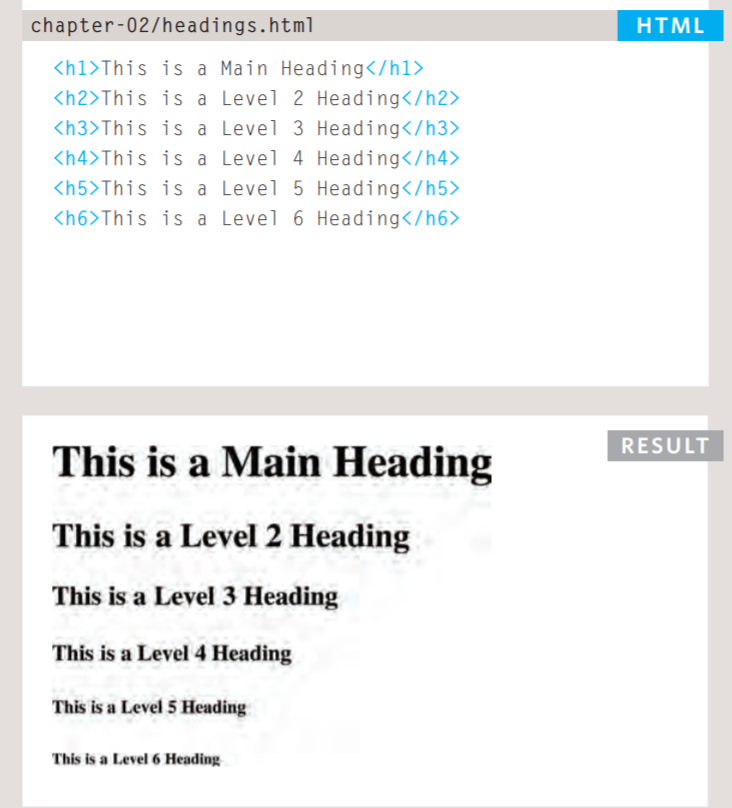
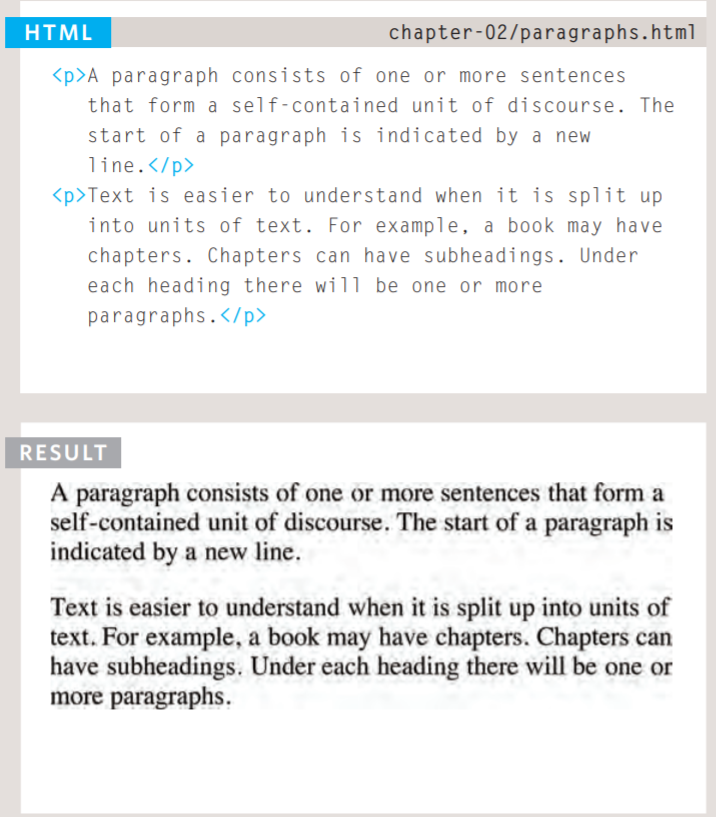
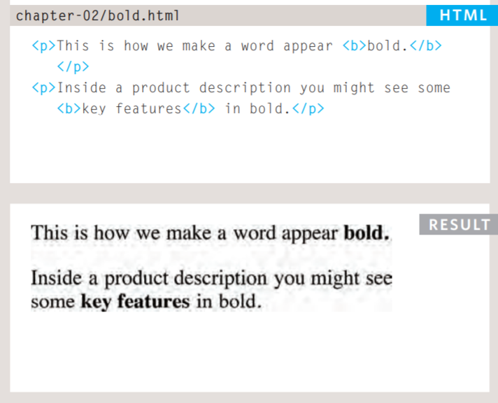
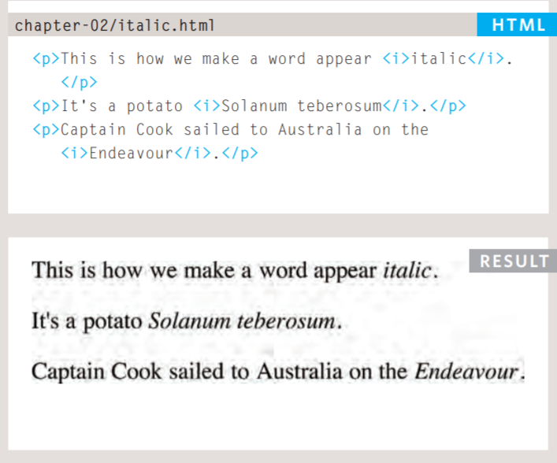
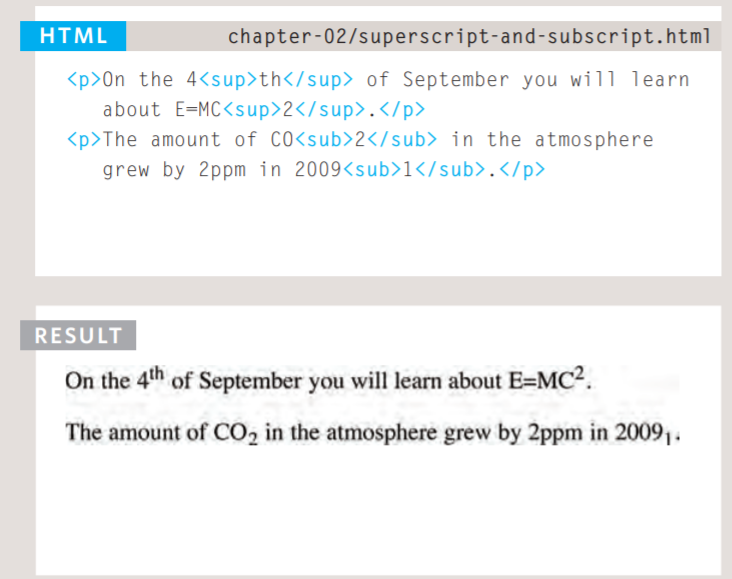
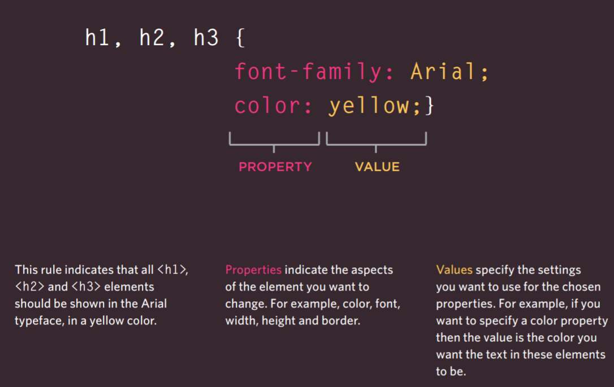

# summary:
* HTML text
* Introducing CSS
* Basic JavaScript Instructions
* Decisions and Loops

## Text:
### We will learn about:
* Headings and paragraphs
* Bold, italic, emphasis
* Structural and semantic markup

### When creating a web page, you add tags (known as markup) to the contents of the page. These tags provide extra meaning and allow browsers to show users the appropriate structure for the page.
### we focus on how to add markup to the text that appears on your pages:
* Structural markup:
  >  the elements that you can use to
describe both headings and paragraphs.
* Semantic markup:
  > which provides extra information; such
as where emphasis is placed in a sentence, that something
you have written is a quotation (and who said it), the
meaning of acronyms, and so on.

# Headings:
## HTML has six "levels" of headings:
\<h1> , \<h2> , \<h3> , \<h4> , \<h5> , \<h6> .

  > \<h1> is used for main headings
  > \<h2> is used for subheadings If there are further sections under the subheadings then the \<h3> element is used, and so on...

 

# Paragraphs:
## To create a paragraph, surround the words that make up the paragraph with an opening \
 tag and closing \
 tag.
   > By default, a browser will show each paragraph on a new line with some space between it and any subsequent paragraphs.

   

 # **Bold** and *Italic*: 
  1. Bold \<b>:
   > By enclosing words in the tags \<b> and \</b> we can make characters appear bold. 

      

  2. Italic \<i>:
   > By enclosing words in the tags \<i> and \</i> we can make characters appear italic.

   

# Superscript and Subscript:
  1. superscript:
   > The \ element is used to contain characters that should be superscript such as the suffixes of dates or mathematical concepts like raising a number to a power such as 2\*2.

   2. Subscript:
    > The \ element is used to contain characters that should be subscript. It is commonly used with foot notes or chemical formulas such as H20.

    

# Semantic markup:
 > There are some text elements that are not intended to affect the structure of your web pages, but they do add extra information to the pages — they are known as semantic markup.
  

# Summary Text:
 > HTML elements are used to describe the structure of
the page (e.g. headings, subheadings, paragraphs).

> They also provide semantic information (e.g. where
emphasis should be placed, the definition of any
acronyms used, when given text is a quotation).

# Introducing CSS:
 * What CSS does
 * How CSS works
 * Rules, properties, and values

# What CSS does:
 > CSS allows you to create rules that specify how the content of
an element should appear. For example, you can specify that
the background of the page is cream, all paragraphs should
appear in gray using the Arial typeface, or that all level one
headings should be in a blue, italic, Times typeface.

# How CSS works:
 > The key to understanding how CSS works is to
imagine that there is an invisible box around
every HTML element.

# Rules, properties, and values:
 > CSS declarations sit inside curly brackets and each is made up of two
parts: a property and a value, separated by a colon. You can specify
several properties in one declaration, each separated by a semi-colon.

# Summary Introducing CSS:
* CSS treats each HTML element as if it appears inside
its own box and uses rules to indicate how that
element should look.
* Rules are made up of selectors (that specify the
elements the rule applies to) and declarations (that
indicate what these elements should look like).
* Different types of selectors allow you to target your
rules at different elements.
* Declarations are made up of two parts: the properties
of the element that you want to change, and the values
of those properties. For example, the font-family
property sets the choice of font, and the value arial
specifies Arial as the preferred typeface.
* CSS rules usually appear in a separate document,
although they may appear within an HTML page.

# Basic JavaScript Instructions:

## THE LANGUAGE: 
  > SYNTAX AND GRAMMAR
like any new language, there are new
words to learn (the vocabulary) and rules
for how these can be put together (the
grammar and syntax of the language). 

## GIVING INSTRUCTIONS:
  > Web browsers (and computers in general)
approach tasks in a very different way than
a human might. Your instructions need to
reflect how computers get things done. 

## Statement:
 > A script is a series of instructions that a computer can follow one-by-one.
Each individual instruction or step is known as a statement.
Statements should end with a semicolon. 

## WHAT IS A VARIABLE? 
  > A script will have to temporarily
store the bits of information it
needs to do its job. It can store this
data in variables. 

## CREATING AN ARRAY:
 > You create an array and give it
a name just like you would any
other variable (using the var
keyword followed by the name of
the array). 

## VALU ES IN ARRAYS:
 > Values in an array are accessed as if they are in
a numbered list. It is important to know that the
numbering of this list starts at zero (not one).

## OPERATORS:
 > Expressions rely on things called operators; they allow programmers to
create a single value from one or more values. 

# Summary Basic JavaScript Instructions:
 * A script is made up of a series of statements. Each
statement is like a step in a recipe. 
* Scripts contain very precise instructions. For example,
you might specify that a value must be remembered
before creating a calculation using that value. 
* Variables are used to temporarily store pieces of
information used in the script. 
* Arrays are special types of variables that store more
than one piece of related information. 
* JavaScript distinguishes between numbers (0-9),
strings (text), and Boolean values (true or false). 
* Expressions evaluate into a single value. 
* Expressions rely on operators to calculate a value. 