# HTML Links, CSS Layout, JS Functions:
 ## we will learn about:
  * HTML Links.
  * Layout & code samples.
  * JavaScript Functions, Methods, and Objects.
  * 6 Reasons for Pair Programming.

# Links:
## How to:
  > * Creating links between pages.
  > * Linking to other sites.
  > * Email links.

##  types of links:
 > * Links from one website to another.
 > * Links from one page to another on the same website.
 > * Links from one part of a web page to another part of the same page.
 > * Links that open in a new browser window.
 > * Links that start up your email program and address a new email to someone.

## Writing Links:
 > * Links are created using the \<a> element. Users can click on anything between the opening \<a> tag and the closing \</a> tag. You specify which page you want to link to using the href attribute.

   > 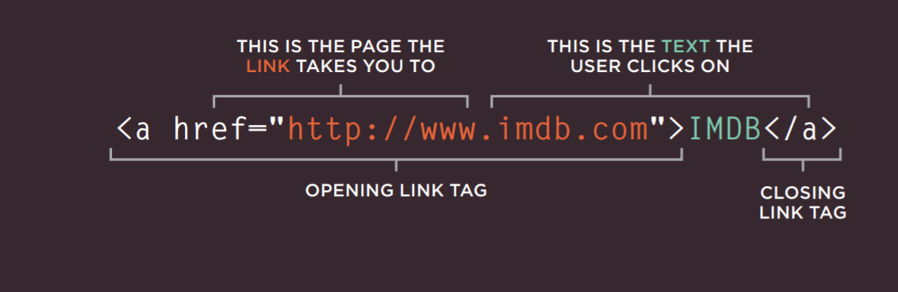

## Linking to Other Sites
 > * Links are created using the \<a> element which has an attribute called href. 
 The value of the href attribute is the page that you want people to go to when they click on the link.

  > * 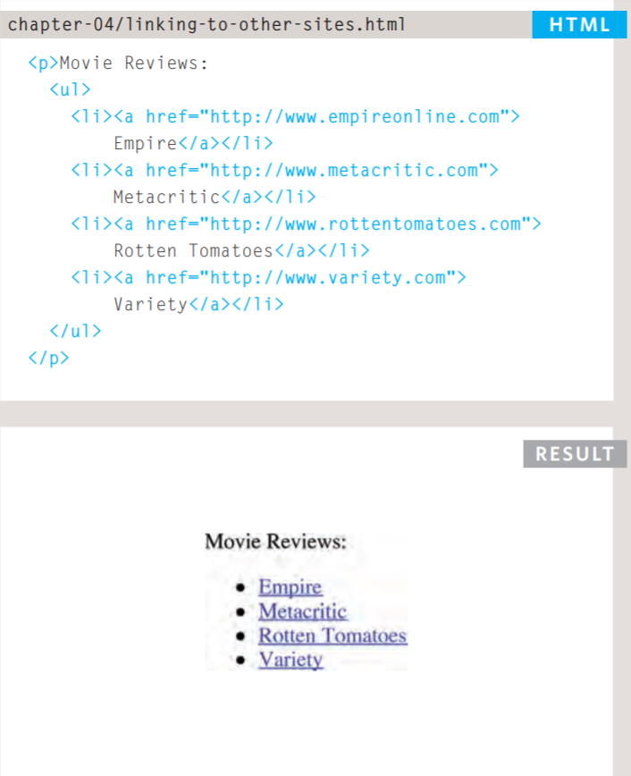

## Linking to Other Pages on the Same Site
 > * When you are linking to other pages within the same site, you do not need to specify the domain name in the URL. You can use a shorthand known as a relative URL.  
  > * the code is: 
    > * 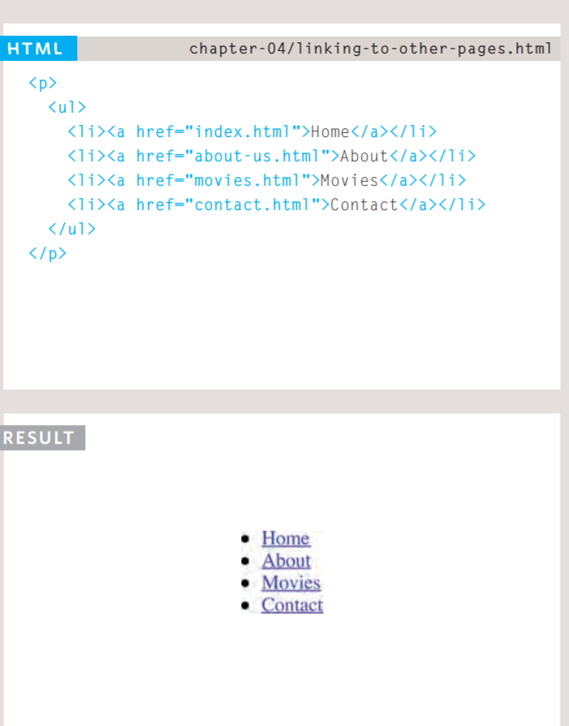

## Email Links
 > * mailto: To create a link that starts up the user's email program and addresses an email to a specified email address, you use the \<a> element. However, this time the value of the href attribute starts with mailto: and is followed by the email address you want the email to be sent to.    
  > * the code is:
   > * 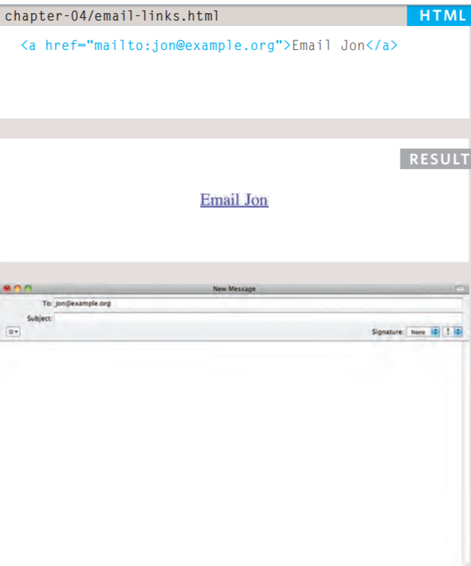

## Opening Links in a New Window   
 > * *target:* If you want a link to open in a new window, you can use the target attribute on the opening \<a> tag. The value of this attribute should be _blank.

  > * 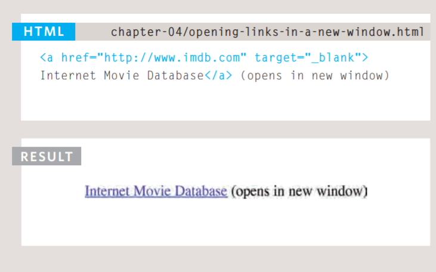

## Linking to a Specific Part of the Same Page
 > * At the top of a long page you might want to add a list of contents that links to the corresponding sections lower down. Or you might want to add a link from part way down the page back to the top of it to save users from having to scroll back to the top.

 > * Before you can link to a specific part of a page, you need to identify the points in the page that the link will go to. You do this using the id attribute (which can be used on every HTML element). You can see that the \<h1> and \<h2> elements in this example have been given id attributes that identify those sections of the page.

 > * The value of the id attribute should start with a letter or an underscore (not a number or any other character) and, on a single page, no two id attributes should have the same value. 
 
  > * Example : 
   > * 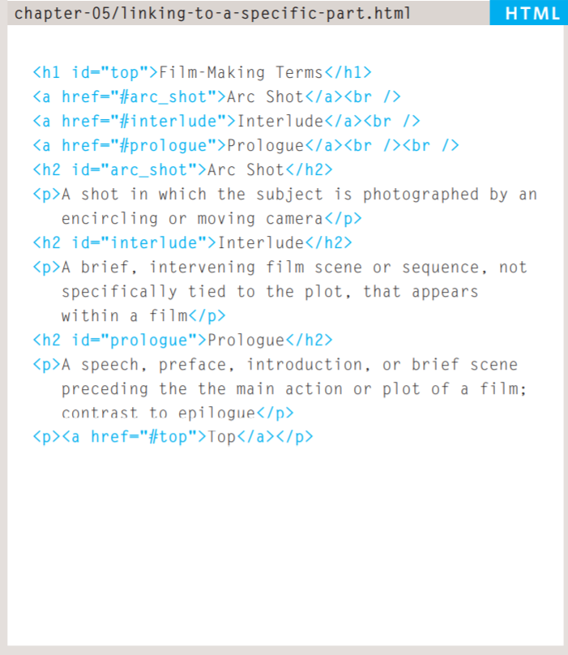

## Linking to a Specific Part of Another Page   
 > * If you want to link to a specific part of a different page (whether on your own site or a different website) you can use a similar technique.

 > * As long as the page you are linking to has id attributes that identify specific parts of the page, you can simply add the same syntax to the end of the link for that page.
 
 > * Therefore, the href attribute will contain the address for the page (either an absolute URL or a relative URL), followed by the \# symbol, followed by the value of the id attribute that is used on the element you are linking to.

# Links Summary:
 > * Links are created using the \<a> element.
 > * The \<a> element uses the href attribute to indicate the page you are linking to.
 > * If you are linking to a page within your own site, it is best to use relative links rather than qualified URLs.
 > * You can create links to open email programs with an email address in the "to" field.
 > * You can use the id attribute to target elements within a page that can be linked to. 

# Layout
 > * Controlling the position of elements.
 > * Creating site layouts.
 > * Designing for different sized screens. 

## Building Blocks
 > * CSS treats each HTML element as if it is in its own box. This box will either be a block-level box or an inline box. 
 > * Block-level elements start on a new line Examples include: \<h1> \
 \<ul> \<li>.
 > * Inline elements flow in between surrounding text Examples include: \ \<b> \<i>.

## Normal Flow
 *(position:static)*
 > * In normal flow, each block-level element sits on top of the next one. Since this is the default way in which browsers treat HTML elements, you do not need a CSS property to indicate that elements should appear in normal flow, but the syntax would be: *(position: static;)*.

 > * 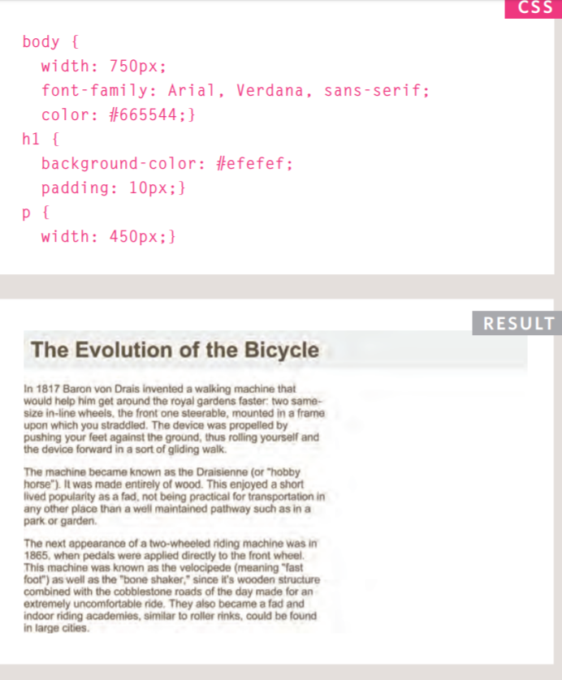

## Relative Positioning
  *(position:relative)*
  > * Relative positioning moves an element in relation to where it would have been in normal flow.

  > * 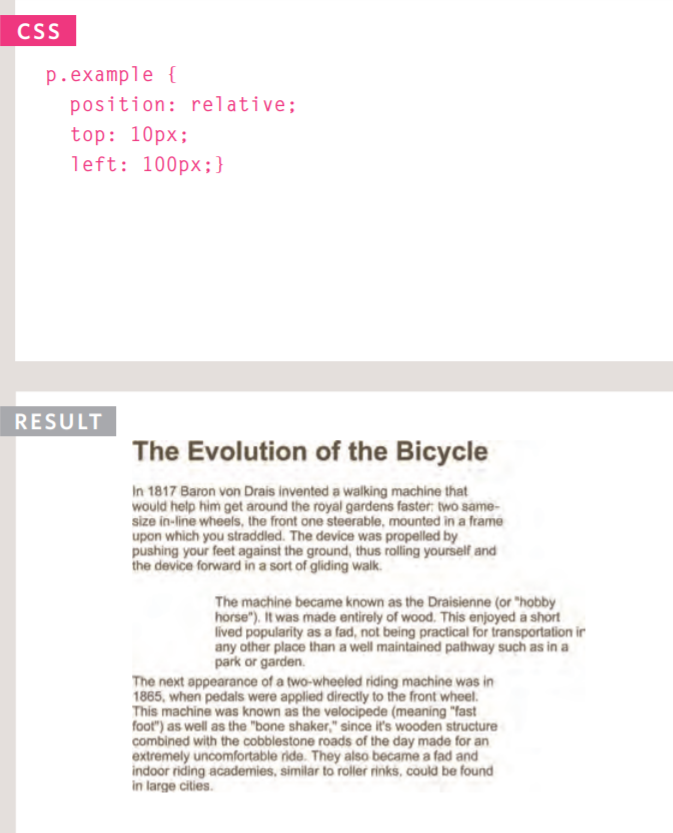

## Absolute Positioning
  *(position:absolute)*
  > * When the position property is given a value of absolute, the box is taken out of normal flow and no longer affects the position of other elements on the page. (They act like it is not there.)  
   

   > * 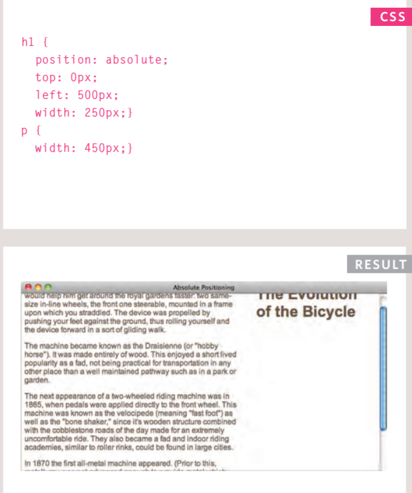

## Fixed Positioning
  *(position:fixed)*
  > * Fixed positioning is a type of absolute positioning that requires the position property to have a value of fixed.  

   > * 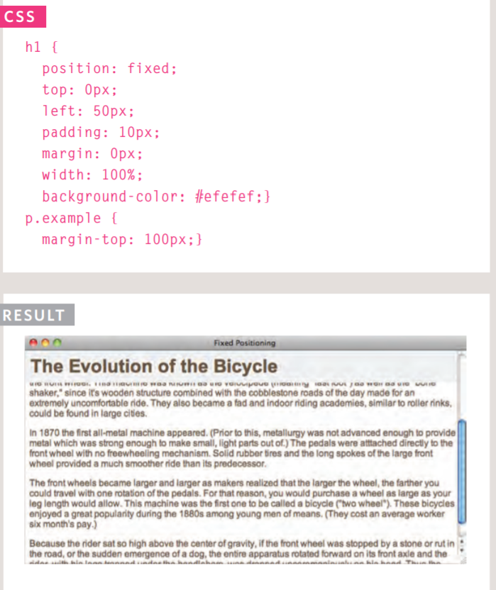

## Overlapping Elements
  *(z-index)*
  > * When you use relative, fixed, or absolute positioning, boxes can overlap. If boxes do overlap, the elements that appear later in the HTML code sit on top of those that are earlier in the page. 

   > * 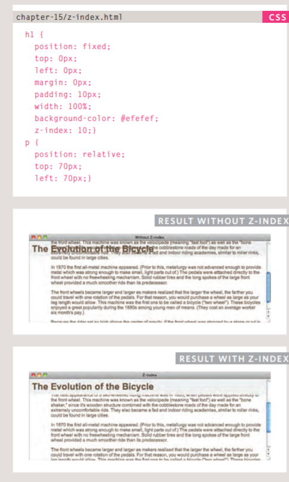

## Floating Elements
  *(float)*
   > * The float property allows you to take an element in normal flow and place it as far to the left or right of the containing element as possible.
      
      > * 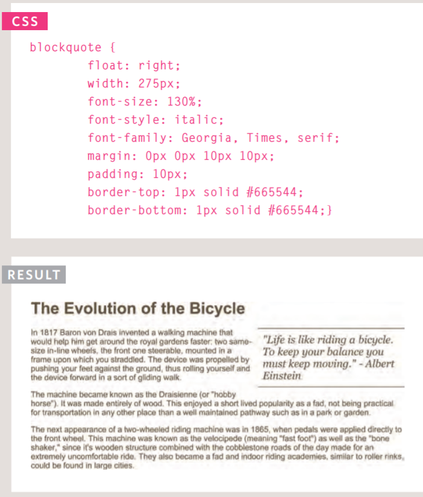

## Using float to place elements side-by-side
 > * A lot of layouts place boxes next to each other. The float property is commonly used to achieve this.      
 > * When elements are floated, the height of the boxes can affect where the following elements sit.

  > * 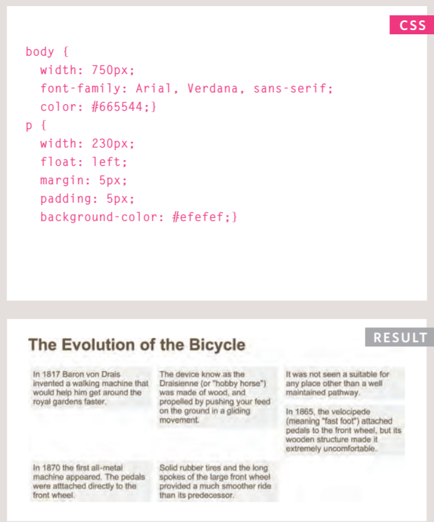

## Clearing Floats
 *(clear)*
 > * The clear property allows you to say that no element (within the same containing element) should touch the left or righthand sides of a box. It can take the following values:  
  > * left: The left-hand side of the box should not touch any other elements appearing in the same containing element.
  > * right: The right-hand side of the box will not touch elements appearing in the same containing element.
  > * both: Neither the left nor right-hand sides of the box will touch elements appearing in the same containing element.
  > * none: Elements can touch either side.

    > * 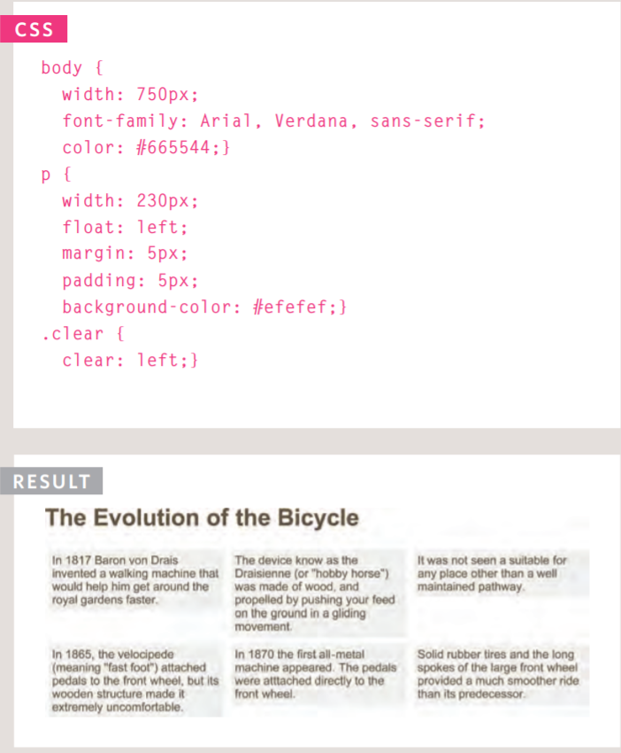

## Screen Resolution
 > * Resolution refers to the number of dots a screen shows per inch. Some devices have a higher resolution than desktop computers and most operating systems allow users to adjust the resolution of their screens.   

## Fixed Width Layouts
 > * Fixed width layout designs do not change size as the user increases or decreases the size of their browser window. Measurements tend to be given in pixels.
 > * To create a fixed width layout, the width of the main boxes on a page will usually be specified in pixels (and sometimes their height, too).

   > * 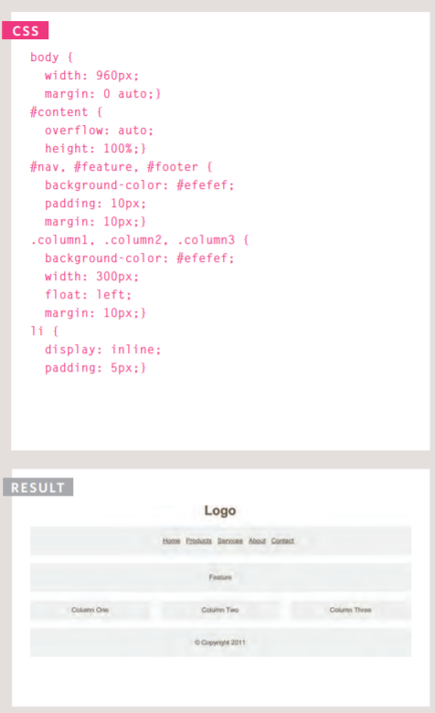

## Liquid Layouts
  > * Liquid layout designs stretch and contract as the user increases or decreases the size of their browser window. They tend to use percentages. 
  > * The liquid layout uses percentages to specify the width of each box so that the design will stretch to fit the size of the screen.

  > * 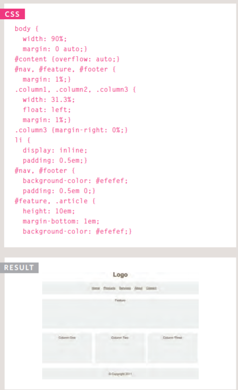

## Multiple Style Sheets
  *(@import)*
   > * Some web page authors split up their CSS style rules into separate style sheets. For example, they might use one style sheet to control the layout and another to control fonts, colors and so on.    

## Layout Summary:
  > * \
 elements are often used as containing elements to group together sections of a page.
  > * Browsers display pages in normal flow unless you specify relative, absolute, or fixed positioning.
  > * The float property moves content to the left or right of the page and can be used to create multi-column layouts. (Floated items require a defined width.)
  > * Pages can be fixed width or liquid (stretchy) layouts.
  > * Designers keep pages within 960-1000 pixels wide, and indicate what the site is about within the top 600 pixels (to demonstrate its relevance without scrolling).
  > * Grids help create professional and flexible designs.
  > * CSS Frameworks provide rules for common tasks.
  > * You can include multiple CSS files in one page.

## Functions, Methods, and Objects
  ## Functions and Methods: 
   > * Functions consist of a series of statements that have been grouped together because they perform a specific task. 
   > * A method is the same as a function, except methods are created inside (and are part of) an object. 

  ## Objects:
  > * programmers use objects to create models of the world using data, and that objects are made up ofproperties and methods.

## WHAT IS A FUNCTION? 
 > * Functions let you group a series of statements together to perform a specific task. If different parts of a script repeat the same task, you can reuse the function (rather than repeating the same set of statements).    

## Declaring a function:
 > * to create a function, you give it a name and then write the statements needed to achieve its task inside the curly braces, htis is known as a function declaration.
  > * 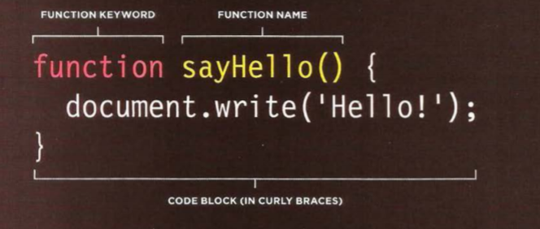

## calling a function
 > * Having declared the function, you can then execute all of the statements between its curly braces with just one line of code, this is known as calling the function. 
  > * 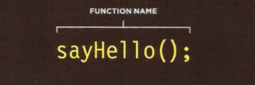

## Declaring functions that need information.
 > * sometimes function need specific information to perform its task.
 in such cases, when you declare the function you give it parameters. inside the function the parameters act like variables.
    > * 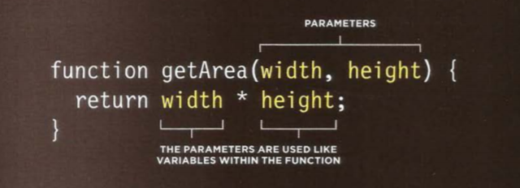

## Calling functions that need information
 > * when you call a function that has parameters, you specify the values it should use in the parentheses that follow its name. the vakues are called arguments, and they can be provided as values or variables.

## HOW MEMORY & VARIABLES WORK 
 > * Global variables use more memory. The browser has to remember them for as long as the web page using them is loaded. Local variables are only remembered during the period of time that a function is being executed.      