# HTML Images; CSS Color & Text

## HTML Images; CSS Color & Text cheat sheet:

# Images:
 > * How to add images to pages.
 > * Choosing the right format.
 > * Optimizing images for the web.

## There are several things to consider when selecting and preparing images for your site, but taking time to get them right will make it look more attractive and professional. 
  > * Include an image in your web pages using HTML.
  > * Pick which image format to use.
  > * Show an image at the right size.
  > * Optimize an image for use on the web to make pages load faster.

## Adding Images:
 > To add an image into the page you need to use an \ element. This is an empty element (which means there is no closing tag). It must carry the following two attributes:  
  > * *src:* This tells the browser where it can find the image file. This will usually be a relative URL pointing to an image on your own site.
  > * *alt:* This provides a text description of the image which describes the image if you cannot see it.
  > * *title:* You can also use the title attribute with the  element to provide additional information about the image.

    > 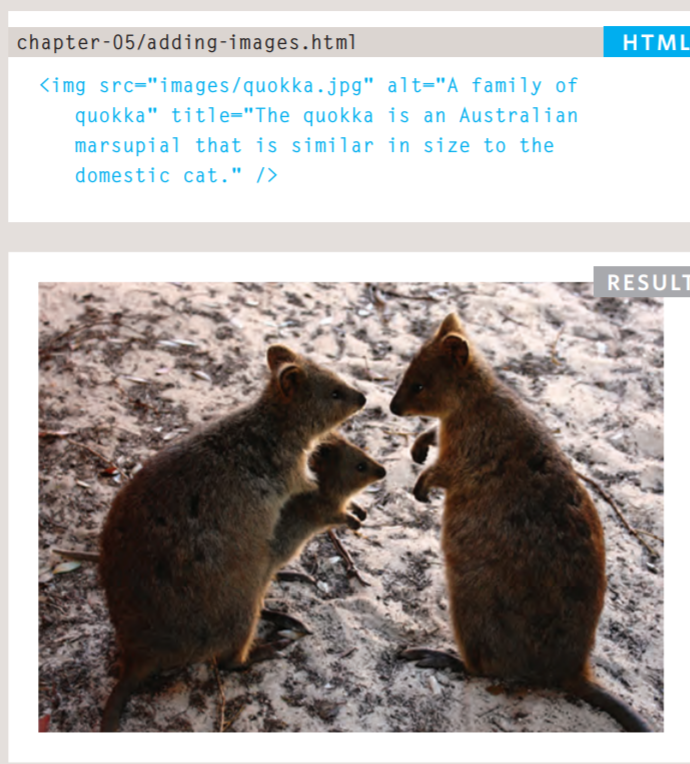

## Height and Width of Images: 
 > * *height:* This specifies the height of the image in pixels.
 > * *width:* This specifies the width of the image in pixels.
  > 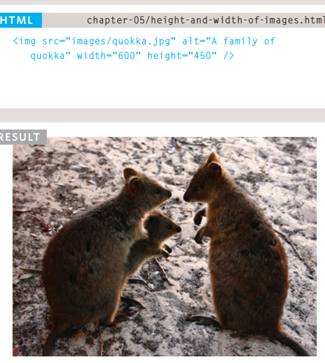

## Three rules for creating images:
 > 1. *Save Images in the right format:*
  > Websites mainly use images in jpeg, gif, or png format. If you choose the wrong image format then your image might not look as sharp as it should and can make the web page slower to load.  
 > 2. *save images at the right size:*
  > You should save the image at the same width and height it will appear on the website. 
 > 3. *Use the correct resolution:*
  >  Resolution refers to the number of dots per inch, and most computer screens only show web pages at 72 pixels per inch. So saving images at a higher resolution results in images that are larger than necessary and take longer to download.  
## Image dimentions:
 > The images you use on your website should be saved at the same width and height that you want them to appear on the page.
  > * REDUCING IMAGE SIZE: You can reduce the size of images to create a smaller version of the image.
  > * INCREASING IMAGE SIZE: You can't increase the size of photos significantly without affecting the image quality.
  > * CHANGING SHAPE: Only some images can be cropped without losing valuable information (see next page).

## HTML5: Figure and Figure Caption:
 > * Images often come with captions. HTML5 has introduced a new \<figure> element to contain images and their caption so that the two are associated. You can have more than one image inside the \<figure> element as long as they all share the same caption.  
 > * The \<figcaption> element has been added to HTML5 in order to allow web page authors to add a caption to an image. Before these elements were created there was no way to associate an \ element with its caption.
   > 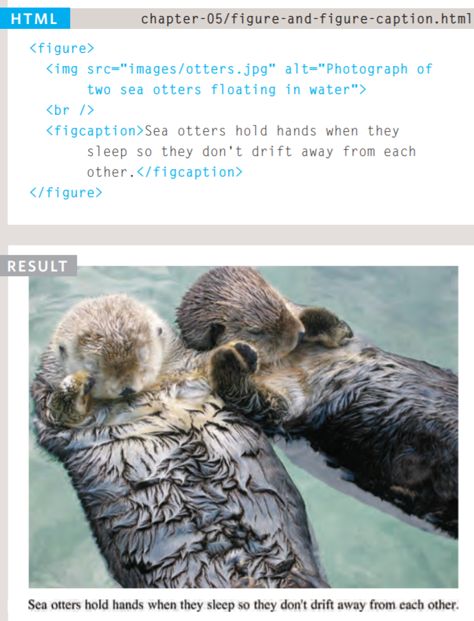

## Images summary:  
  > * The \ element is used to add images to a web page.
  > * You must always specify a src attribute to indicate the source of an image and an alt attribute to describe the content of an image.
  > * You should save images at the size you will be using them on the web page and in the appropriate format.
  > * Photographs are best saved as JPEGs; illustrations or logos that use flat colors are better saved as GIFs.

# color:
## > * How to specify colors.
## > * Color terminology and contrast.
## > * Background color.

## Foreground Color:
 ## *Color:*
 > The color property allows you to specify the color of text inside an element. You can specify any color in CSS in one of three ways:
  > 1. *rgb values:* 
   > These express colors in terms of how much red, green and blue are used to make it up. **For example: rgb(100,100,90).**
  > 2. *hex codes:*
   > These are six-digit codes that represent the amount of red, green and blue in a color, preceded by a pound or hash # sign. **For example: #ee3e80.**
  > 3. *color names:*
   > There are 147 predefined color names that are recognized by browsers. **For example: DarkCyan.**
     > 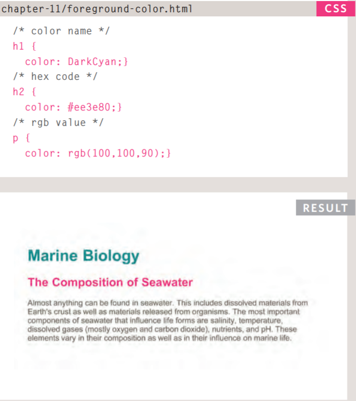

 ## *Background color: (background-color)
  > CSS treats each HTML element as if it appears in a box, and the background-color property sets the color of the background for that box.
  > 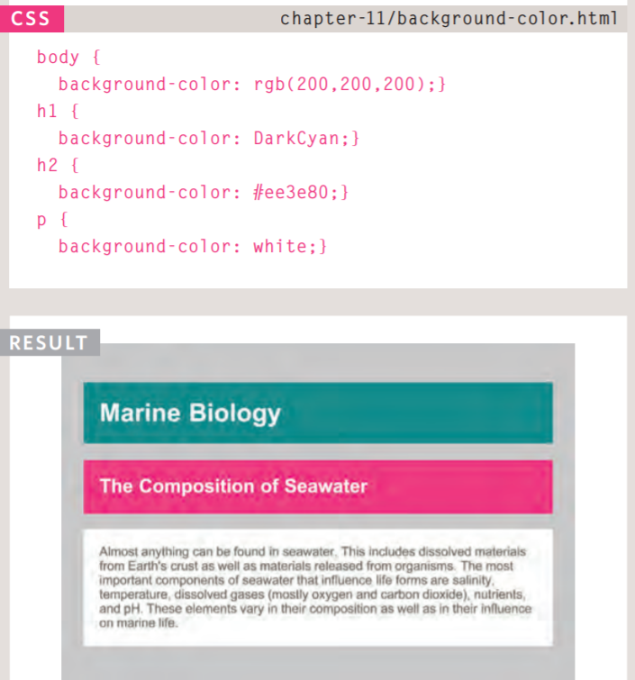

## Understanding Color
 > Every color on a computer screen is created by mixing amounts of red, green, and blue. To find the color you want, you can use a color picker.
  > 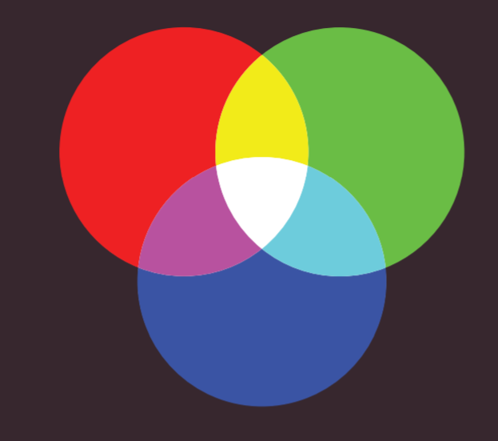

## CSS3: Opacity.
 > * opacity:
  > CSS3 introduces the opacity property which allows you to specify the opacity of an element and any of its child elements. The value is a number between 0.0 and 1.0 (so a value of 0.5 is 50% opacity and 0.15 is 15% opacity).
 > *  rgba:
  > The CSS3 rgba property allows you to specify a color, just like you would with an RGB value, but adds a fourth value to indicate opacity. This value is known as an alpha value and is a number between 0.0 and 1.0 (so a value of 0.5 is 50% opacity and 0.15 is 15% opacity). The rgba value will only affect the element on which it is applied (not child elements).  
    > 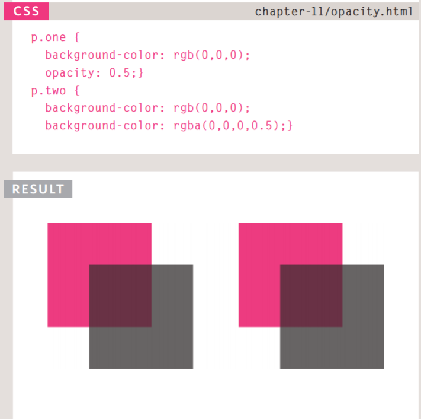

## CSS3: HSL & H *(hsl, hsla):*
 > * hsl:
  > The hsl color property has been introduced in CSS3 as an alternative way to specify colors. The value of the property starts with the letters hsl, followed by individual values inside parentheses for:
  > 1. hue: This is expressed as an angle (between 0 and 360 degrees).
  > 2. saturation: This is expressed as a percentage.
  > 3. lightness: This is expressed as a percentage with 0% being white, 50% being normal, and 100% being black.

 > * hsla:
  > The hsla color property allows you to specify color properties using hue, saturation, and lightness as above, and adds a fourth value which represents transparency (just like the rgba property). The a stands for:
  > * alpha: This is expressed as a number between 0 and 1.0. For example, 0.5 represents 50% transparency, and 0.75 represents 75% transparency.

## Color Summary:
 > * Color not only brings your site to life, but also helps convey the mood and evokes reactions. 
 > * There are three ways to specify colors in CSS: RGB values, hex codes, and color names.
 > * Color pickers can help you find the color you want.
 > * It is important to ensure that there is enough contrast between any text and the background color (otherwise people will not be able to read your content).
 > * CSS3 has introduced an extra value for RGB colors to indicate opacity. It is known as RGBA.
 > * CSS3 also allows you to specify colors as HSL values, with an optional opacity value. It is known as HSLA.

# Text:
 ## We will learn about:
 > * Size and typeface of text.
 > * Bold, italics, capitals, underlines.
 > * Spacing between lines, words, and letters.

## Specifying Typefaces:
 ### font-family:
 > * The font-family property allows you to specify the typeface that should be used for any text inside the element(s) to which a CSS rule applies.
 > * The value of this property is the name of the typeface you want to use. 
 > * You can specify a list of fonts separated by commas so that, if the user does not have your first choice of typeface installed, the browser can try to use an alternative font from the list.
  > 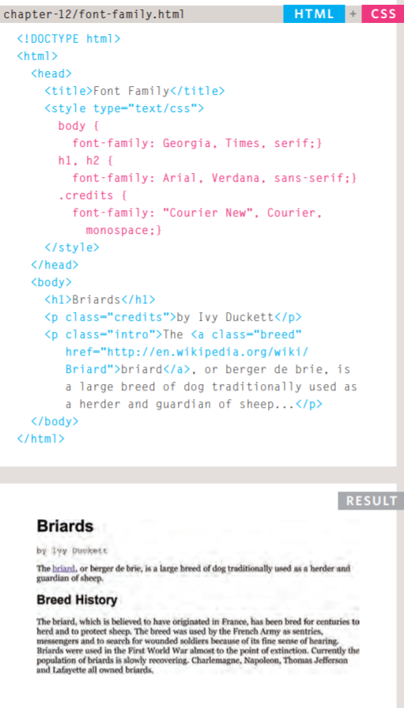

## Size of Type:
 > *font-size*
 > The font-size property enables you to specify a size for the font. There are several ways to specify the size of a font. The most common are:
  > 1. pixels: Pixels are commonly used because they allow web designers very precise control over how much space their text takes up. The number of pixels is followed by the letters px.
  > 2. percentages: The default size of text in browsers is 16px. So a size of 75% would be the equivalent of 12px, and 200% would be 32px.
  > 3. ems: An em is equivalent to the width of a letter m.
   
   > 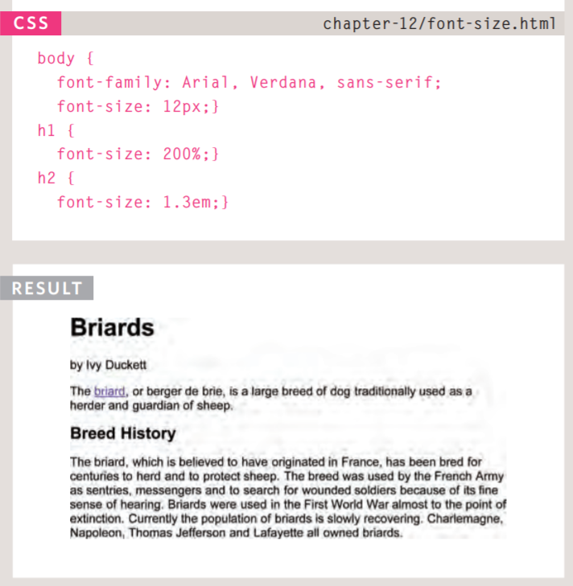

## More Font Choice:
 > *@font-face*
 > * @font-face allows you to use a font, even if it is not installed on the computer of the person browsing, by allowing you to specify a path to a copy of the font, which will be downloaded if it is not on the user's machine. 
 > * You add the font to your style sheet using the @font-face rule:
  > 1. font-family:  This specifies the name of the font. This name can then be used as a value of the font-family property in the rest of the style sheet (as shown in the rule for the <h1> and <h2> elements). 
  > 2. src:  This specifies the path to the font. In order for this technique to work in all browsers, you will probably need to specify paths to a few different versions of the font, as shown on the next page.
   > 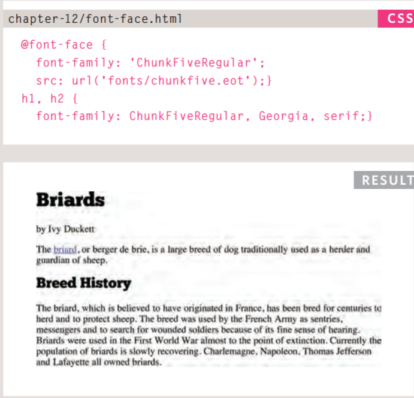

## Bold *(font-weight):*
 > * The font-weight property allows you to create bold text. There are two values that this property commonly takes:
  > * normal: This causes text to appear at a normal weight.
  > * bold: This causes text to appear bold.

  > 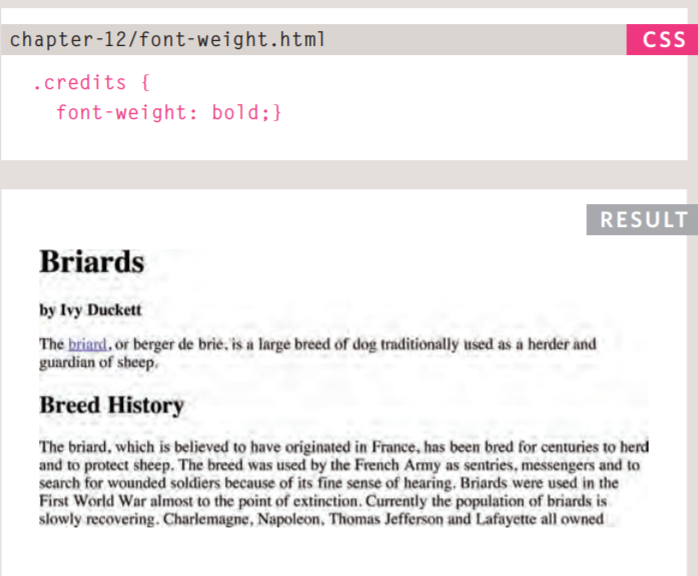

## Italic *(font-style)*
 > * If you want to create italic text, you can use the font-style property. There are three values this property can take: 
  > 1. normal: This causes text to appear in a normal style (as opposed to italic or oblique).
  > 2. italic: This causes text to appear italic.
  > 3. oblique: This causes text to appear oblique.
   > 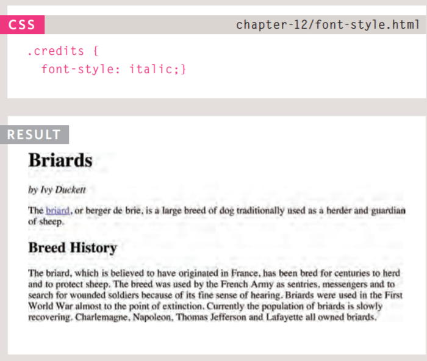

## UpperCase & LowerCase
 *(text-transform)*
 > * The text-transform property is used to change the case of text giving it one of the following values:
  > * uppercase: This causes the text to appear uppercase.
  > * lowercase: This causes the text to appear lowercase.
  > * capitalize: This causes the first letter of each word to appear capitalized.
    > 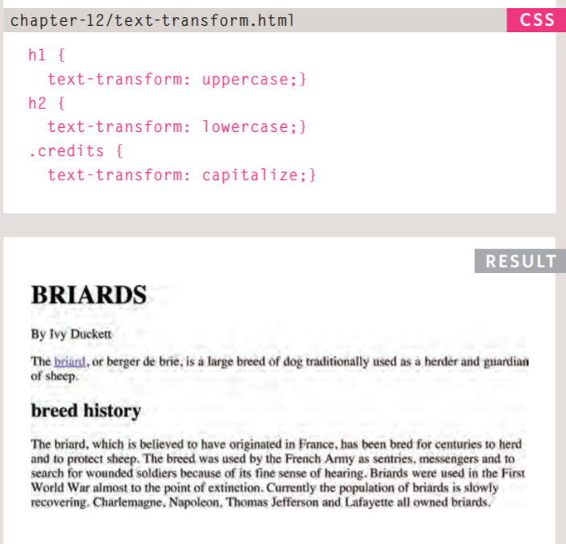

## Underline & Strike
 *(text-decoration)*
 > * The text-decoration property allows you to specify the following values:
  > * none: This removes any decoration already applied to the text.
  > * underline: This adds a line underneath the text.
  > * overline: This adds a line over the top of the text.
  > * line-through: This adds a line through words.
  > * blink: This animates the text to make it flash on and off (however this is generally frowned upon, as it is considered rather annoying).
   > 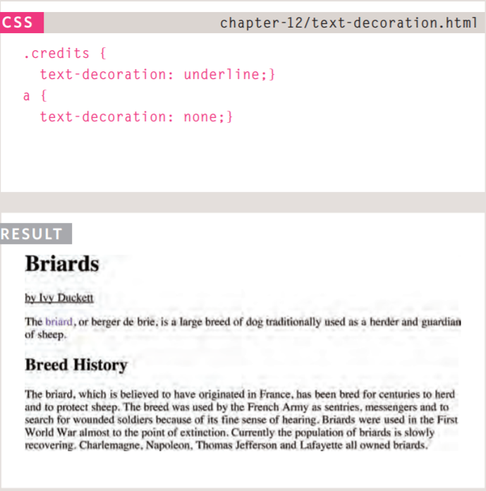

## Leading
 *(line-height)*
 > * Leading is use for the vertical space between lines of text.  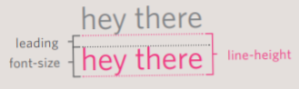
 > * In CSS, the line-height property sets the height of an entire line of text, so the difference between the fontsize and the line-height is equivalent to the leading.
 > * Increasing the line-height makes the vertical gap between lines of text larger.
  > 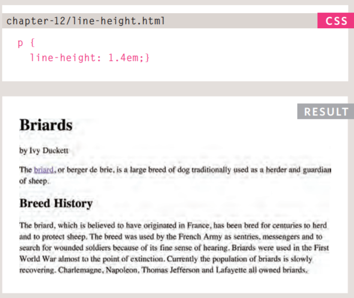

## Letter & Word Spacing
 *(letter-spacing, word-spacing)*
  > * Kerning is the term typographers use for the space between each letter. You can control the space between each letter with the letter-spacing property.
  > * You can also control the gap between words using the word-spacing property. 
   > 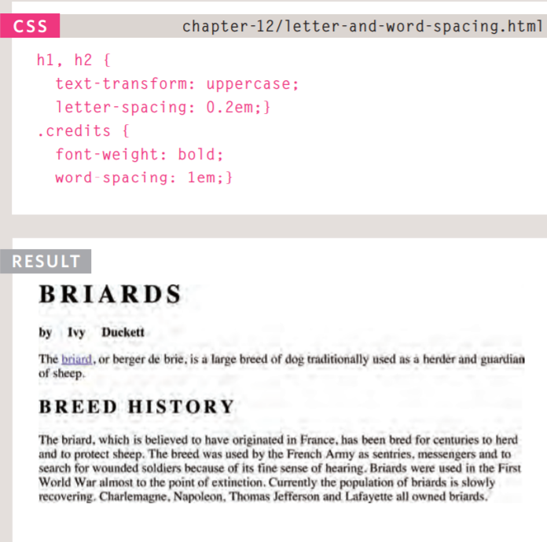

## Alignment
 *(text-align)*
  > * The text-align property allows you to control the alignment of text. The property can take one of four values:  
   > 1. left: This indicates that the text should be left-aligned.
   > 2. right: This indicates that the text should be right-aligned.
   > 3. center: This allows you to center text.
   > 4. justify: This indicates that every line in a paragraph, except the last line, should be set to take up the full width of the containing box.
    > 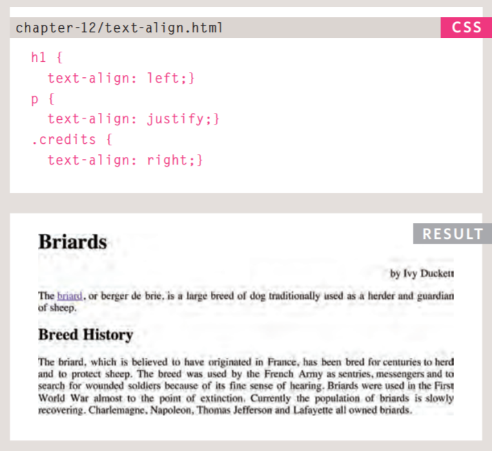

## Vertical Alignment
 *(vertical-align)*
  > * The vertical-align property is a common source of confusion. It is not intended to allow you to vertically align text in the middle of block level elements such as \
 and \
, although it does have this effect when used with table cells (the \<td> and \<th> elements).
  > * It is more commonly used with inline elements such as \, \<em>, or \<strong> elements. When used with these elements, it performs a task very similar to the HTML align attribute used on the \ element, which you met on pages 103-106. The values it can take are:
   > *baseline, sub, super, top, text-top, middle, bottom,and text-bottom.*

## Indenting Text
 *(text-indent)*
  > * The text-indent property allows you to indent the first line of text within an element. The amount you want the line indented by can be specified in a number of ways but is usually given in pixels or ems.
   > 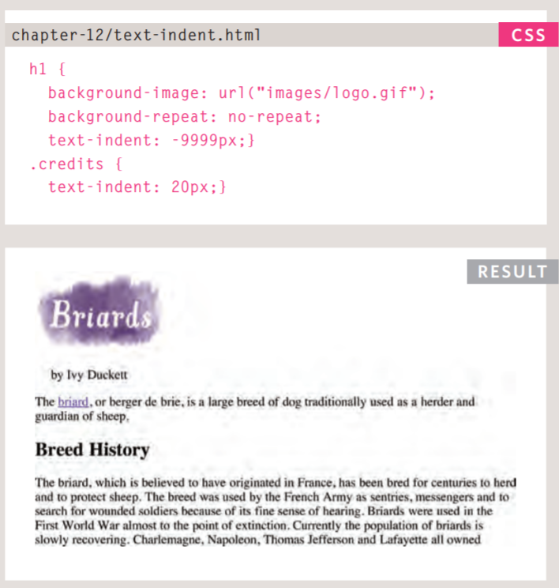

## CSS3: Drop Shadow
 *(text-shadow)*
  > * It is used to create a drop shadow, which is a dark version of the word just behind it and slightly offset. It can also be used to create an embossed effect by adding a shadow that is slightly lighter than the text. 
   > 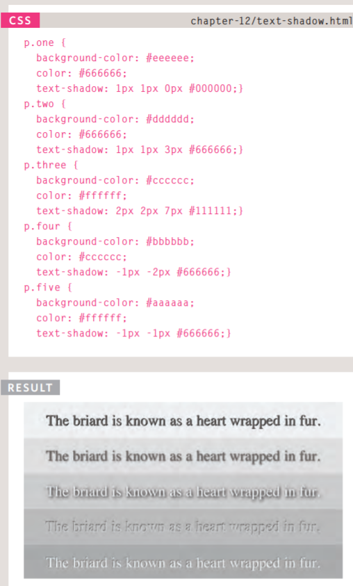

## First Letter or Line
 *(:first-letter, :first-line)*
 > * You can specify different values for the first letter or first line of text inside an element using :first-letter and :first-line.
 > * Technically these are not properties. They are known as pseudo-elements. 
 > * You specify the pseudo-element at the end of the selector, and then specify the declarations as you would normally for any other element.
   > 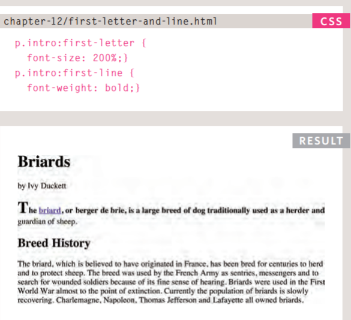

# Text Summary
 > * There are properties to control the choice of font, size, weight, style, and spacing.   
 > * There is a limited choice of fonts that you can assume most people will have installed.
 > * If you want to use a wider range of typefaces there are several options, but you need to have the right license to use them.
 > * You can control the space between lines of text, individual letters, and words. Text can also be aligned to the left, right, center, or justified. It can also be indented.
 > * You can use pseudo-classes to change the style of an element when a user hovers over or clicks on text, or when they have visited a link.

  *Thank you for reading* *Alaa Aldous*