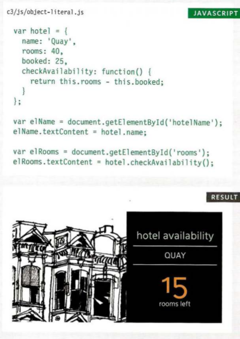
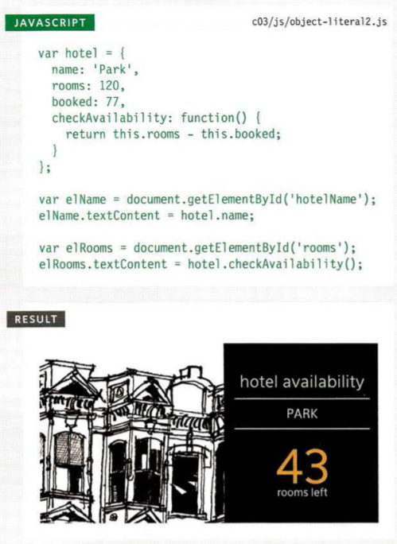
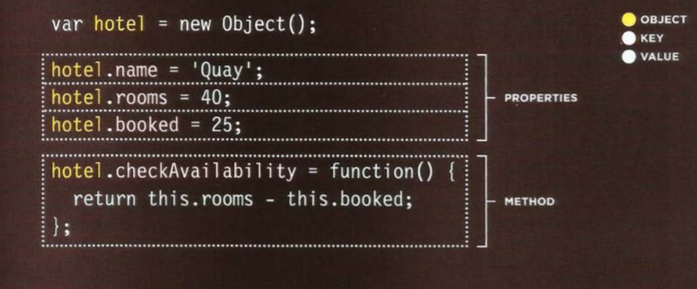

## JS Object Literals; The DOM:

## Learning Mistakes:
 > * The Most Important Skill Any Software Developer Can Have Is Knowing How to LEARN.
 > * Today’s successful developer is a master at diving deep into a new piece of tech, slicing it into bite-sized chunks and absorbing the critical 20% that lets him work productively while other developers are still scratching their heads and searching Stack Overflow.

## 10 Steps To Learn Anything Quickly:
 > * breaking out of the “learning cattle chute” can help you master even the most challenging technologies quickly.
 > * The reason why including a mandatory “play time” in your study sessions can rocket you up the learning curve faster than you thought possible—even though you feel like you’re just goofing off.
 > * A reliable heuristic for knowing what to read—and what to ignore. That’s right: Dumping that massive stack of unread books and deleting your Instapaper queue will actually make you a faster learner. (This will free you from “Amazon reading list guilt” forever.)
 > * How to harness your natural creativity and curiosity for better, faster learning (with zero frustration and overwhelm).
 > * How to chart your own course for learning a new topic. This will free you from the soft tyranny of book authors and trainers who think they know the best way for you to learn.
 > * The 3 critical questions you must answer when you start learning anything new. (Don’t waste weeks wandering around lost and confused. These questions will point you in the right direction, every time.)
 > * How to quickly get a “toehold” on any new topic before you dive deep. This technique lets you skip right past the part where your head spins from overwhelm.
 > * How to break out of the “infinite reading loop,” where the more you read, the more your reading list grows.
 > * The way to set yourself up for learning success. When you do this, you’ll know when you’re done with a topic and ready to move on to new challenges.
 > * How you can use your new learning superpowers to quickly gain respect as a leader and an authority. Your team will look to you when it’s time to evaluate new technologies, and you’ll have top-notch employers beating down your door.
 > * How to learn more by learning less. (This is critical to eliminating overwhelm—and actually putting what you’re learning into practice.)

## Object Literals:
> * WHAT IS AN OBJECT?
  > * Objects group together a set of variables and functions to create a model of a something you would recognize from the real world. In an object, variables and functions take on new names.  
    > * IN AN OBJECT: VARIABLES BECOME KNOWN AS PROPERTIES.
    > * IN AN OBJECT: FUNCTIONS BECOME KNOWN AS METHODS.

## CREATING· OBJECTS USING:
  *LITERAL NOTATION*
  > * 

## CREATING MORE OBJECT LITERALS:
 
 > * 

## Creating an object: Constructor notation.
> * The new keyword and the object constructor create a blank object, you can then add properties and methods to the object.
 > *  

## Document Object Model:
 > * The Document Object Model (DOM) specifies how browsers should create a model of an HTML page and how JavaScript can access and update the contents of a web page while it is in the browser window.  

## THE DOM TREE IS A MODEL OF A WEB PAGE:
 > * As a browser loads a web page, it creates a model of that page. The model is called a DOM tree, and it is stored in the browsers' memory. It consists of four main types of nodes.  

## WORKING WITH THE DOM TREE:
 > * Accessing and updating the DOM tree involves two steps: 
  > 1. Locate the node that represents the element you want to work with. 
  > 2. Use its text content, child elements, and attributes.

## ACCESSING ELEMENTS:
 > * DOM queries may return one element, or they may return a Nodelist, which is a collection of nodes.  

## SELECTING ELEMENTS USING ID ATTRIBUTES: 
 > * get El ementByi d () allows you to select a single element node by specifying the value of its id attribute. 

## NODELISTS: DOM QUERIES THAT RETURN MORE THAN ONE ELEMENT 
 > * When a DOM method can return more than one element, it returns a Nodelist (even if it only finds one matching element). 
 > * A Nodelist is a collection of element nodes. Each node is given an index number (a number that starts at zero, just like an array). 
 > * The order in which the element nodes are stored in a Node List is the same order that they appeared in the HTML page. 
 > * Nodelists look like arrays and are numbered like arrays, but they are not actually arrays; they are a type of object called a collection.

## SELECTING AN ELEMENT FROM A NODELIST:
> * There are two ways to select an element from a Nodelist: The item() method and array syntax. Both require the index number of the element you want. 

## SELECTI NG ELEMENTS USING CLASS ATTRIBUTES:
 > * The get El ementsByCl ass Name() method allows you to select elements whose c 1 ass attribute contains a specific value. 
 > * The method has one parameter: the class name which is given in quotes within the parentheses after the method name. 
 > * Because several elements can have the same value for their class attribute, this method always returns a Nodelist. 

## SELECTING ELEMENTS BY TAG NAME:
 > * The get El ementsByTagName () method allows you to select elements using their tag name.
 > * The element name is specified as a parameter, so it is placed inside the parentheses and is contained by quote marks. 
 > * Note that you do not include the angled brackets that surround the tag name in the HTML (just the letters inside the brackets). 

## SELECTING ELEMENTS USING CSS SELECTORS:
 > * querySe 1 ector() returns the first element node that matches the CSS-style selector. querySe 1ectorA11 () returns a Nodelist of all of the matches. 
 > * Both methods take a CSS selector as their only parameter. The CSS selector syntax offers more flexibility and accuracy when selecting an element than
 > * just specifying a class name or a tag name, and should also be familiar to front-end web developers who are used to targeting elements using CSS.  

## LOOPING THROUGH A NODELIST:
 > * If you want to apply the same code to numerous elements, looping through a Nodelist is a powerful technique.
 > * It involves finding out how many items are in the Nodelist, and then setting a counter to loop through them, one-by-one. 
 > * Each time the loop runs, the script checks that the counter is less than the total number of items in the Nodelist. 

## TRAVERSING THE DOM:
 > * When you have an element node, you can select another element in relation to it using these five properties. This is known as traversing the DOM. 

## WHITESPACE NODES:
 > * Traversing the DOM can be difficult because some browsers add a text node whenever they come across whitespace between elements.

## ACCESS & UPDATE A TEXT NODE WITH NODEVALUE:
 > * When you select a text node, you can retrieve or amend the content of it using the node Va 1 ue property.   

## ACCESSING & CHANGING A TEXT NODE:
 > * To work with text in an element, first the element node is accessed and then its text node.
 > * The text node has a property called node Value which returns the text in that text node. 
 > * You can also use the node Va1ue property to update the content of a text node. 
  
## ACCESS & UPDATE TEXT & MARKUP WITH INNERHTML: 
 > * Using the i nnerHTML property, you can access and amend the contents of an element, including any child elements. 

## ADDING ELEMENTS USING DOM MANIPULATION:
 > * DOM manipulation offers another technique to add new content to a page (rather than innerHTML). It involves three steps: 
   > 1. CREATE THE ELEMENT: *createEl ement ()*
   > 2. GIVE IT CONTENT :  *createTextNode()*
   > 3. ADD IT TO THE DOM:  *appendChild()* 

## REMOVING AN ELEMENT FROM THE DOM TREE:
 > * This example uses the removeCh i 1 d () method to remove the fourth item from the list (along with its contents). 
 > * The first variable, removeEl, stores the actual element you want to remove from the page (the fourth list item). 
 > * The second variable, cont a i nerEl, stores the \<u1> element that contains the element you want to remove. 

## CROSS-SITE SCRIPTING (XSS) ATTACKS:
 > * If you add HTML to a page using i nnerHTML (or several jQuery methods), you need to be aware of Cross-Site Scripting Attacks or XSS; otherwise, an attacker could gain access to your users' accounts. 

## XSS: ESCAPING & CONTROLLING MARKUP: 
 > * Any content generated by users that contain characters that are used in code should be escaped on the server. You must control any markup added to the page. 

## CREATING ATTRIBUTES & CHANGING THEIR VALUES:
 > * The cl assName property allows you to change the value of the class attribute. If the attribute does not exist, it will be created and given the specified value.  
 > * You have seen this property used throughout the chapter to update the status of the list items. Below, you can see another way to achieve the task.
 > * The setAttri bute() method allows you to update the value of any attribute. It takes two parameters: the attribute name, and the value for the attribute. 

## Document object model summary:
 > * The browser represents the page using a DOM tree.
 > * DOM trees have four types of nodes: document nodes, element nodes, attribute nodes, and text nodes.
 > * You can select element nodes by their id or cl ass attributes, by tag name, or using CSS selector syntax.
 > * Whenever a DOM query can return more than one node, it will always return a Nadel i st.
 > * From an element node, you can access and update its content using properties such as textContent and innerHTML or using DOM manipulation techniques. 
 > * An element node can contain multiple text nodes and child elements that are siblings of each other.  
 > * In older browsers, implementation of the DOM is inconsistent (and is a popular reason for using jQuery).  
 > * Browsers offer tools for viewing the DOM tree .

*Alaa Aldous*
   
 
 