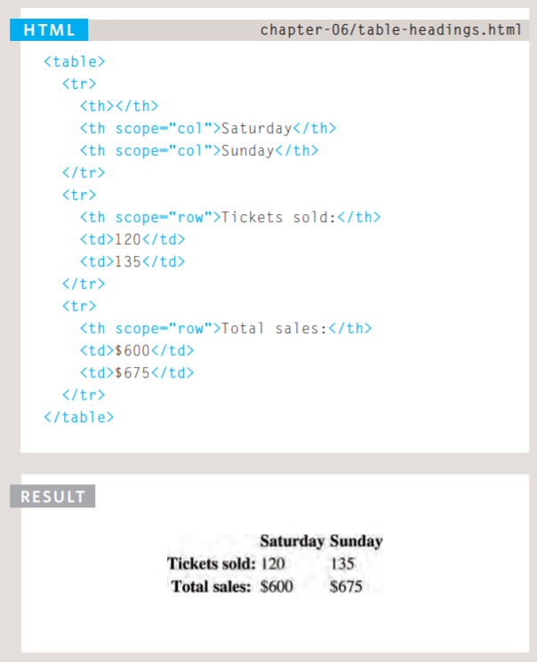

## Domain Modeling & HTML Tables; JS Constructor Functions

## Domain Modeling
 Domain modeling is the process of creating a conceptual model in code for a specific problem. A model describes the various entities, their attributes and behaviors, as well as the constraints that govern the problem domain. An entity that stores data in properties and encapsulates behaviors in methods is commonly referred to as an object-oriented model.
  > * Define a constructor and initialize properties:
   > * To define the same properties between many objects, you'll want to use a constructor function. 
    > * 

  > * Generate random numbers:
   > * To model the random nature of user behavior, you'll need the help of a random number generator. Fortunately, the JavaScript standard library includes a Math.random() function for just this sort of occasion.
    > * 

  > * Calculate daily Likes:
   > * for example, To calculate the number of viewers per day, generate a random number between 10 and 30 and then multiply it by the epic rating of that video.
    > * 

   > * Calculate weekly Likes:
    > * 

## Domain modeling summary:
 > * When modeling a single entity that'll have many instances, build self-contained objects with the same attributes and behaviors. 
 > * Model its attributes with a constructor function that defines and initializes properties.
 > * Model its behaviors with small methods that focus on doing one job well.
 > * Create instances using the new keyword followed by a call to a constructor function.
 > * Store the newly created object in a variable so you can access its properties and methods from outside.
 > * Use the this variable within methods so you can access the object's properties and methods from inside.

## Tables:
  > * How to create tables.
  > * What information suits tables.
  > * How to represent complex data in tables.

## What's a Table?
 > * A table represents information in a grid format. Examples of tables include financial reports, TV schedules, and sports results.

## Basic Table Structure: 
 > * *\<table>*:  The \<table> element is used to create a table. The contents of the table are written out row by row.    
 > * *\<tr>*:  You indicate the start of each row using the opening \<tr> tag. (The tr stands for table row.)           
 > * *\<td>*:  Each cell of a table is represented using a \<td> element. (The td stands for table data.)
  > * 

## Table Headings: 
 > * *\<th>*:  The \<th> element is used just like the \<td> element but its purpose is to represent the heading for either a column or a row. (The th stands for table heading.)    
  
  > * 

## Tables summary:
 > * The \<table> element is used to add tables to a web page.
 > * A table is drawn out row by row. Each row is created with the \<tr> element.
 > * Inside each row there are a number of cells represented by the \<td> element (or \<th> if it is a header).
 > * You can make cells of a table span more than one row or column using the rowspan and colspan attributes.
 > * For long tables you can split the table into a \<thead>, \<tbody>, and \<tfoot>.

## Functions, Methods, and Objects: 
 
## creating an object:
## Constructor notation:
 > * The new keyword and the object constructor create a blank object, you can then add properties and methods to the object.

## Updating an object:
 > * To update the value of properties, use dot notation or square brackets, the work on objects created using literal or constructor notation, to delete a property use the delete keyword.

## CREATING MANY OBJECTS: *CONSTRUCTOR NOTATION*
 > * Sometimes you will want several objects to represent similar things. Object constructors can use a function as a template for creating objects. First, create the template with the object's properties and methods. 

 > * CREATING OBJECTS USING CONSTRUCTOR SYNTAX:
  > * 

 > * CREATE & ACCESS OBJECTS CONSTRUCTOR NOTATION:
  > * 

 > * ADDING AND REMOVING PROPERTIES:  
  > * 

## THIS (IT IS A KEYWORD) 
 > * The keyword this is commonly used inside functions and objects. Where the function is declared alters what this means. It always refers to one object, usually the object in which the function operates. 

## RECAP: STORING DATA 
 > * In JavaScript, data is represented using name/value pairs. To organize your data, you can use an array or object to group a set of related values. In arrays and objects the name is also known as a key.  

## THE DOCUMENT OBJECT MODEL:
 ## THE DOCUMENT OBJECT 
 > * The topmost object in the Document Object Model (or DOM) is the document object. It represents the web page loaded into the current browser window or tab. 

## GLOBAL OBJECTS:
## STRING O BJECT
 > * Whenever you have a value that is a string, you can use the properties and methods of the String object on that value. This example stores the phrase "Home sweet home " in a variable.     
  > * var saying = 'home sweet home' ;

## DATA TYPES REVISITED 
 > * In JavaScript there are six data types: Five of them are described as simple (or primitive) data types. The sixth is the object (and is referred to as a complex data type).  

## Functions, Methods, and Objects summary:
 > * Functions allow you to group a set of related statements together that represent a single task. 
 > * Functions can take parameters (informatiorJ required to do their job) and may return a value. 
 > * An object is a series of variables and functions that represent something from the world around you.   
 > * In an object, variables are known as properties of the object; functions are known as methods of the object.  
 > * Web browsers implement objects that represent both the browser window and the document loaded into the browser window.
 > * JavaScript also has several built-in objects such as String, Number, Math, and Date. Their properties and methods offer functionality that help you write scripts. 
 > * Arrays and objects can be used to create complex data sets (and both can contain the other). 

  *Alaa ALdous* 