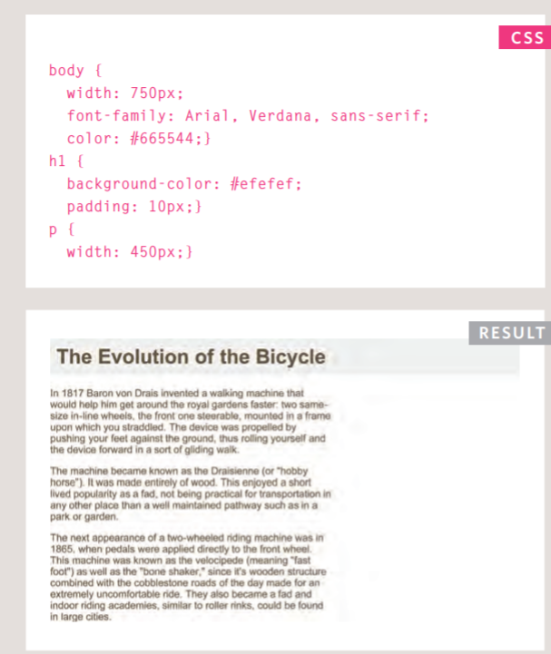
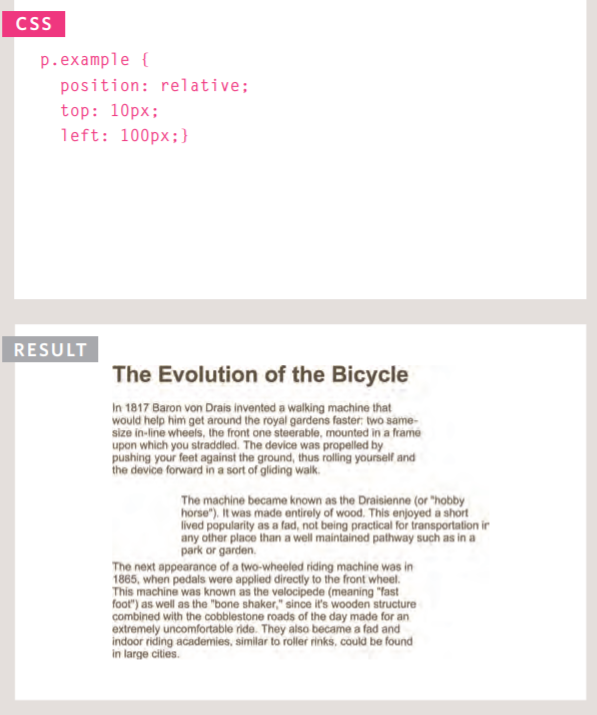
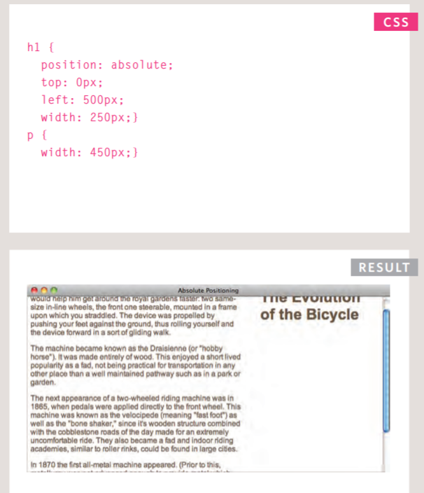
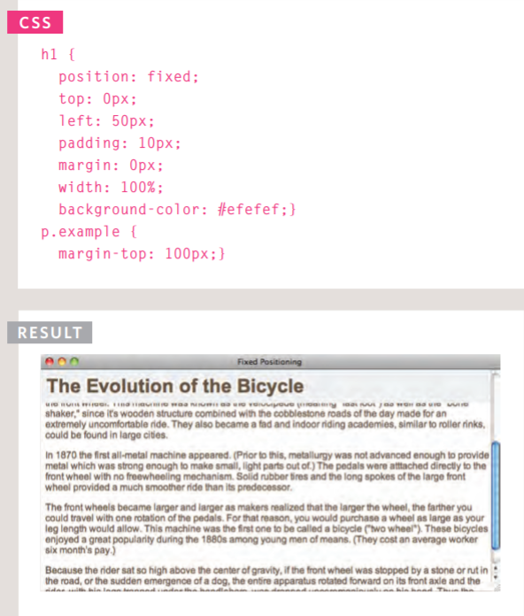
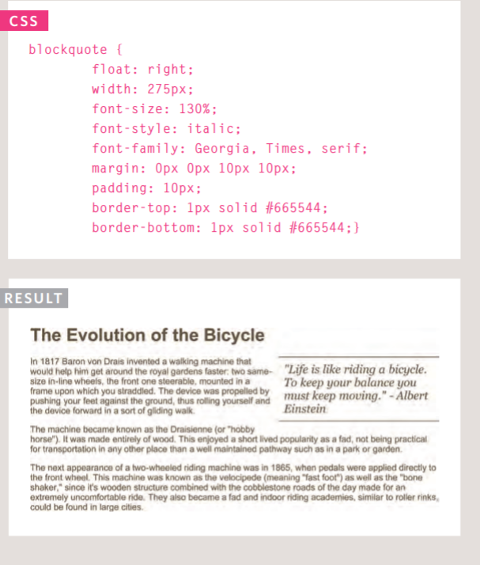

# More CSS Layout

## Controlling the position of elements.
## Creating site layouts.
## Designing for different sized screens.

## Key Concepts in Positioning Elements
 >  * Building Blocks: CSS treats each HTML element as if it is in its own box. This box will either be a block-level box or an inline box.
  > * Block-level elements:  start on a new line Examples include: *\<h1> \
 \<ul> \<li>*.
  > * Inline elements:  flow in between surrounding text Examples include: *\ \<b> \<i>*.

 > * Containing Elements:  If one block-level element sits inside another block-level element then the outer box is known as the containing or parent element.  

## Controlling the Position of Elements:
 > * CSS has the following positioning schemes that allow you to control the layout of a page: normal flow, relative positioning, and absolute positioning. You specify the positioning scheme using the position property in CSS. You can also float elements using the float property. 

  > * Normal Flow: 
   *position:static* 
   > * In normal flow, each block-level element sits on top of the next one. Since this is the default way in which browsers treat HTML elements, you do not need a CSS property to indicate that elements should appear in normal flow, but the syntax would be: position: static; 
   > * 

 > * Relative Positioning:
    *position:relative*
    > * Relative positioning moves an element in relation to where it would have been in normal flow.

    > * 
 > * Absolute Positioning:
     *position:absolute*
     > * When the position property is given a value of absolute, the box is taken out of normal flow and no longer affects the position of other elements on the page. (They act like it is not there.) 

     > * 

 > * Fixed Positioning:
   *position:fixed*
    > * Fixed positioning is a type of absolute positioning that requires the position property to have a value of fixed.
     > * 

 > * Floating Elements:
     *float*
     > * The float property allows you to take an element in normal flow and place it as far to the left or right of the containing element as possible.
     > * 
    
## Screen Sizes
 > * Different visitors to your site will have different sized screens that show different amounts of information, so your design needs to be able to work on a range of different sized screens. 

## Screen Resolution
 > * Resolution refers to the number of dots a screen shows per inch. Some devices have a higher resolution than desktop computers and most operating systems allow users to adjust the resolution of their screens. 

## Page Sizes
 > * Because screen sizes and display resolutions vary so much, web designers often try to create pages of around 960-1000 pixels wide (since most users will be able to see designs this wide on their screens).

## Fixed Width Layouts
 > * Fixed width layout designs do not change size as the user increases or decreases the size of their browser window. Measurements tend to be given in pixels. 

## Liquid Layouts
 > * Liquid layout designs stretch and contract as the user increases or decreases the size of their browser window. They tend to use percentages. 

## CSS Frameworks
 > * CSS frameworks aim to make your life easier by providing the code for common tasks, such as creating layout grids, styling forms, creating printer-friendly versions of pages and so on. You can include the CSS framework code in your projects rather than writing the CSS from scratch.

## Layout Summary:
 > * \
 elements are often used as containing elements to group together sections of a page.
 > * Browsers display pages in normal flow unless you specify relative, absolute, or fixed positioning.
 > * The float property moves content to the left or right of the page and can be used to create multi-column layouts. (Floated items require a defined width.)
 > * Pages can be fixed width or liquid (stretchy) layouts.
 > * Designers keep pages within 960-1000 pixels wide, and indicate what the site is about within the top 600 pixels (to demonstrate its relevance without scrolling).
 > * Grids help create professional and flexible designs.
 > * CSS Frameworks provide rules for common tasks.
 > * You can include multiple CSS files in one page.

 *Alaa ALdous*