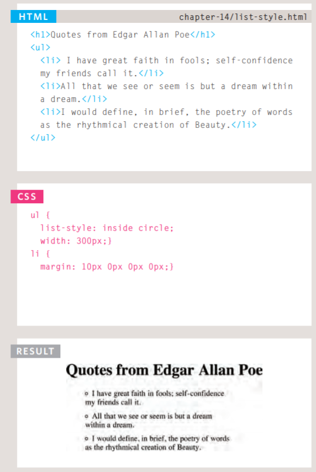
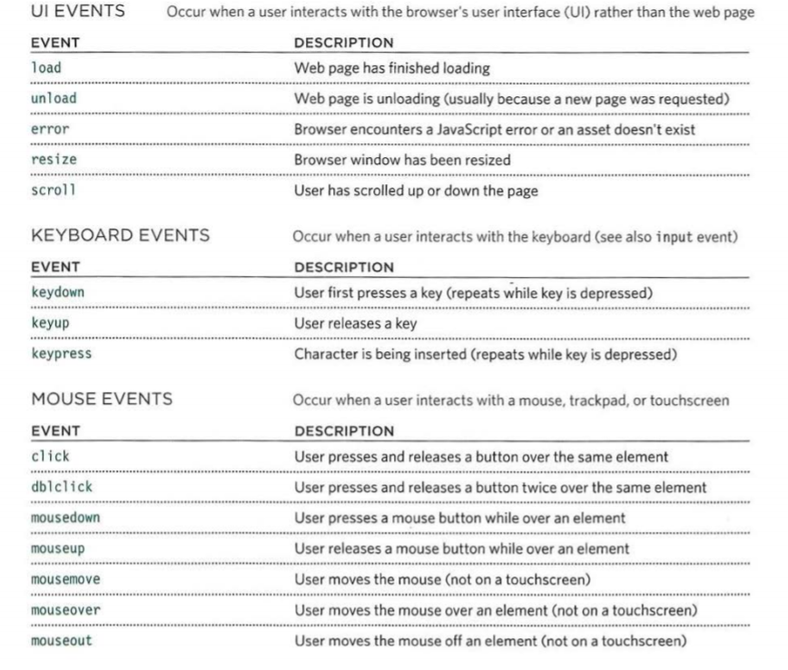

## Forms and JS Events
 
## Forms:
 > * How to collect information from visitors.
 > * Different kinds of form controls.
 > * New HTML5 form controls.

## Form Controls
 > * There are several types of form controls that you can use to collect information from visitors to your site. 

## Form Structure:
 > * *\<form>*:  Form controls live inside a \<form> element. This element should always carry the action attribute and will usually have a method and id attribute too.
 > * action: Every \<form> element requiresan action attribute. Its valueis the URL for the page on theserver that will receive the information in the form when it is submitted.
 > * method:  Forms can be sent using one of two methods: get or post.
 > * id:  the value is used to identify the form distinctly from other elements on the page (and is often used by scripts — such as those that check you have entered information into fields that require values).

  > * 

## Text Input:
 > * \<input>: The \<input> element is used to create several different form controls. The value of the type attribute determines what kind of input they will be creating.   
 > * type="text":  When the type attribute has a value of text, it creates a singleline text input.
 > * name:  When users enter information into a form, the server needs to know which form control each piece of data was entered into. 
 > * maxlength:  You can use the maxlength attribute to limit the number of characters a user may enter into the text field.

  > * 

## Text Area:
 > * \<textarea>:  The <textarea> element is used to create a mutli-line text input. Unlike other input elements this is not an empty element. It should therefore have an opening and a closing tag. 
 > * 

## Multiple Select Box: 
 > * *\<select>*:
  > * size: You can turn a drop down select box into a box that shows more than one option by adding the size attribute. Its value should be the number of options you want to show at once.
  > * multiple:  You can allow users to select multiple options from this list by adding the multiple attribute with a value of multiple. 
   
   > * 

## Submit Button:
 > * *\<input>*:
  > * type="submit":  The submit button is used to send a form to the server.   
  > * name:  It can use a name attribute but it does not need to have one.
  > * value:  The value attribute is used to control the text that appears on a button. 

   > * 

## Image Button: 
 > * *\<input>*:
  > * type="image":  If you want to use an image for the submit button, you can give the type attribute a value of image. The src, width, height, and alt attributes work just like they do when used with the \ element.
   > * 

## Forms summary:
 > * Whenever you want to collect information from visitors you will need a form, which lives inside a \<form> element.  
 > * Information from a form is sent in name/value pairs.
 > * Each form control is given a name, and the text the user types in or the values of the options they select are sent to the server.
 > * HTML5 introduces new form elements which make it easier for visitors to fill in forms.
    
 
## Lists, Tables and Forms:
 > * Specifying bullet point styles.
 > * Adding borders and backgrounds to tables.
 > * Changing the appearance of form elements.

## Bullet Point Styles
 > * list-style-type: The list-style-type property allows you to control the shape or style of a bullet point (also known as a marker).  

## Images for Bullets
 > * list-style-image: 
 > * You can specify an image to act as a bullet point using the list-style-image property. 
 > * The value starts with the letters url and is followed by a pair of parentheses. Inside the parentheses, the path to the image is given inside double quotes.
 > * This property can be used on rules that apply to the \<ul> and \<li> elements.
    
    > * 

## List Shorthand:
 > * list-style: 
  > * As with several of the other CSS properties, there is a property that acts as a shorthand for list styles. It is called list-style, and it allows you to express the markers' style, image and position properties in any order.

  > * 

## Gaps Between Cells:
 > * collapse:  Borders are collapsed into a single border where possible. (border-spacing will be ignored and cells pushed together, and empty-cells properties will be ignored.)
 > * separate:  Borders are detached from each other. (border-spacing and empty-cells will be obeyed.)

 > * 

## Cursor Styles
 > * The cursor property allows you to control the type of mouse cursor that should be displayed to users.  
  
  > * 

## LISTS, TABLES AND FORMS SUMMARY:
 > * In addition to the CSS properties covered in other chapters which work with the contents of all elements, there are several others that are specifically used to control the appearance of lists, tables, and forms.  
 > * List markers can be given different appearances using the list-style-type and list-style image properties.
 > * Table cells can have different borders and spacing in different browsers, but there are properties you can use to control them and make them more consistent. 
 > * Forms are easier to use if the form controls are vertically aligned using CSS.
 > * Forms benefit from styles that make them feel more interactive.

## Events:
 > * DIFFERENT EVENT TYPES:
  > * Here is a selection of the events that occur in the browser while you are browsing the web. Any of these events can be used to trigger a function in your JavaScript code. 
  > * 

## HOW EVENTS TRIGGER JAVASCRIPT CODE:
 > * When the user interacts with the HTML on a web page, there are three steps involved in getting it to trigger some JavaScript code. Together these steps are known as event handling. 

## EVENT LISTENERS :
 > * Event listeners are a more recent approach to handling events. They can deal with more than one function at a time but they are not supported in older browsers.  

## THE EVENT OBJECT:
 > * When an event occurs, the event object tells you information about the event, and the element it happened upon. 

## EVENT DELEGATION: 
 > * Creating event listeners for a lot of elements can slow down a page, but event flow allows you to listen for an event on a parent element. 
 
## CHANGING DEFAULT BEHAVIOR:
 > * The event object has methods that change: the default behavior of an element and how the element's ancestors respond to the event. 

## WH ICH ELEMENT DID AN EVENT OCCUR ON?     
 > * When calling a function, the event object's target property is the best way to determine which element the event occurred on. But you may see the approach below used; it relies on the this keyword. 

## USER INTERFACE EVENTS :
 > * User interface CUI) events occur as a result of interaction with the browser window rather than the HTML page contained within it, e.g., a page having loaded or the browser window being resized.  

## FORM EVENTS:
 > * There are two events that are commonly used with forms. In particular you are likely to see submit used in form validation.  
  
## Events Summary:
 > * Events are the browser's way of indicating when something has happened (such as when a page has finished loading or a button has been clicked). 
 > * Binding is the process of stating which event you are waiting to happen, and which element you are waiting for that event to happen upon. 
 > * When an event occurs on an element, it can trigger a JavaScript function. When this function then changes the web page in some way, it feels interactive because it has responded to the user. 
 > * You can use event delegation to monitor for events that happen on all of the children of an element. 
 > * The most commonly used events are W3C DOM events, although there are others in the HTMLS specification as well as browser-specific events. 

 this cheat sheet created by *Alaa Aldous*
