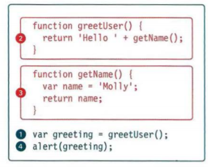

## ERROR HANDLING & DEBUGGING 
 > * JavaScript can be hard to learn and everyone makes mistakes when writing it. it's important to learn how to find the errors in your code. and how to write scripts that deal with potential errors gracefully. 

## ORDER OF EXECUTION 
 > * To find the source of an error, it helps to know how scripts are processed. The order in which statements are executed can be complex; some tasks cannot complete until another statement or function has been run: 
  > * 

## EXECUT.ION CONTEXTS:
 > * The JavaScript interpreter uses the concept of execution contexts. There is one global execution context; plus, each function creates a new new execution context. They correspond to variable scope. 

## EXECUTION CONTEXT & HOISTING:
 > * Each time a script enters a new execution context, there are two phases of activity:  
  > * PREPARE :
    > * The new scope is created.
    > * Variables, functions, and arguments are created.
    > * The value of the this keyword is determined.

  > * EXECUTE:
   > * Now it can assign values to variables.
   > * Reference functions and run their code.
   > * Execute statements.

## UNDERSTANDING SCOPE:
 > * In the interpreter, each execution context has its own va ri ables object. It holds the variables, functions, and parameters available within it. Each execution context can also access its parent's v a ri ables object.  

## UNDERSTANDING ERRORS:
 > * If a JavaScript statement generates an error, then it throws an exception. At that point, the interpreter stops and looks for exception-handl ing code. 

## ERROR OBJECTS:
 > * Error objects can help you find where your mistakes are and browsers have tools to help you read them.    

## A DEBUGGING WORKFLOW:
 > * Debugging is about deduction: eliminating potential causes of an error. Here is a workflow for techniques you will meet over the next 20 pages. Try to narrow down where the problem might be, then look for clues.      
  
## BROWSER DEV TOOLS & JAVASCRIPT CONSOLE:
 > * The JavaScript console will tell you when there is a problem with a script, where to look for the problem, and what kind of issue it seems to be. 

## WRITING FROM THE SCRIPT TO THE CONSOLE:
 > * Browsers that have a console have a console object, which has several methods that your script can use to display data in the console. The object is documented in the Console API. 

## BREAKPOINTS:
 > * You can pause the execution of a script on any line using breakpoints. Then you can check the values stored in variables at that point in time.  

## STEPPING THROUGH CODE:
> * If you set multiple breakpoints, you can step through them one-by-one to see where values change and a problem might occur. 

## CONDITIONAL BREAKPOINTS:
 > * You can indicate that a breakpoint should be triggered only if a condition that you specify is met. The condition can use existing variables.  

## ERROR HANDLING & DEBUGGING SUMMARY:
 > * If you understand execution contexts (which have two stages) and stacks, you are more likely to find the error in your code.
 > * Debugging is the process of finding errors. It involves a process of deduction.  
 > * The console helps narrow down the area in which the error is located, so you can try to find the exact error. 
 > * JavaScript has 7 different types of errors. Each creates its own error object, which can tell you its line number and gives a description of the error. 
 > * If you know that you may get an error, you can handle it gracefully using the try, catch, finally statements. Use them to give your users helpful feedback.

*this cheat sheet created by Alaa Aldous* 
 

   