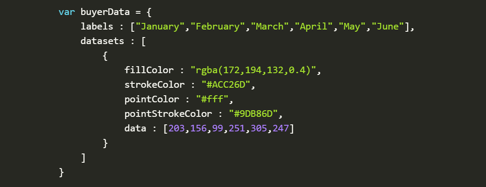
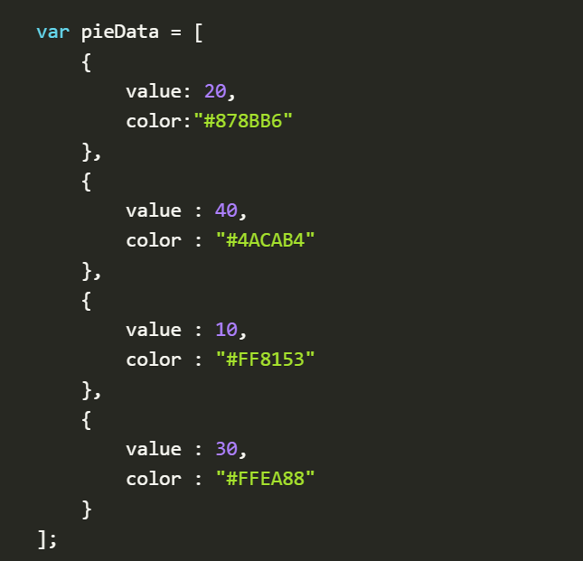
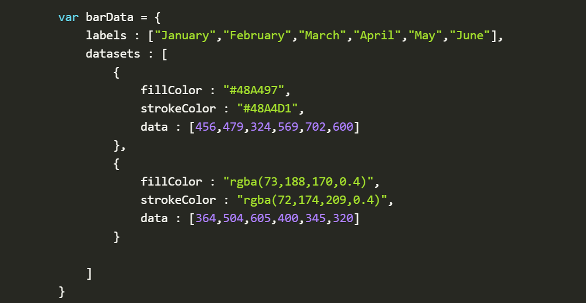
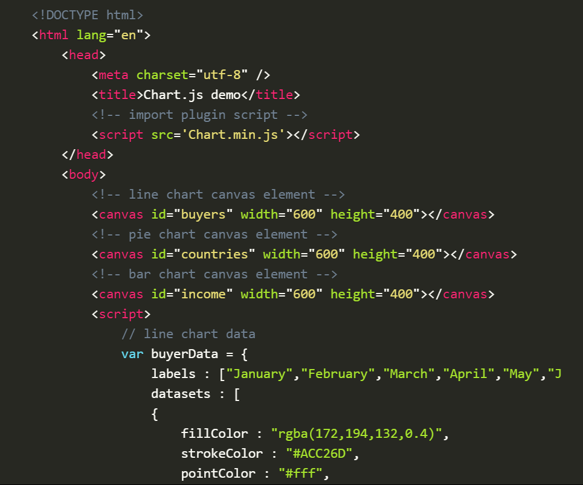
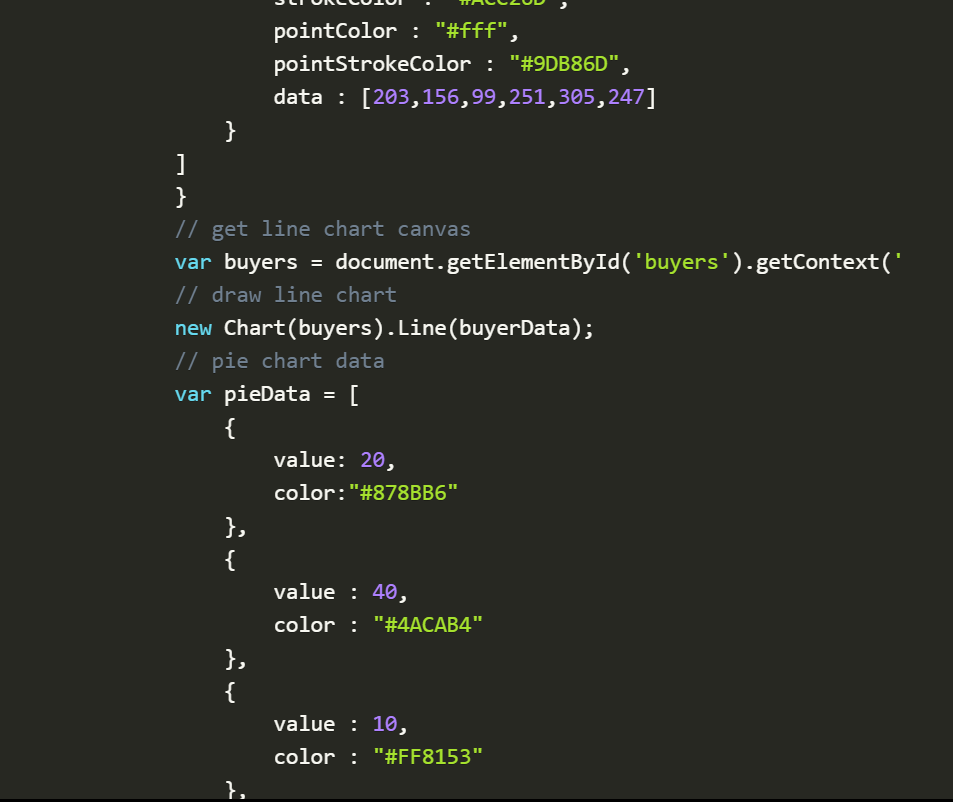
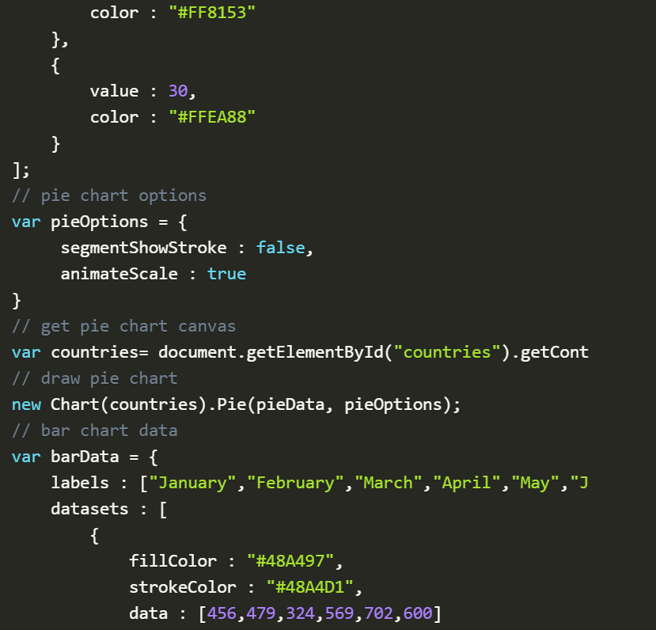
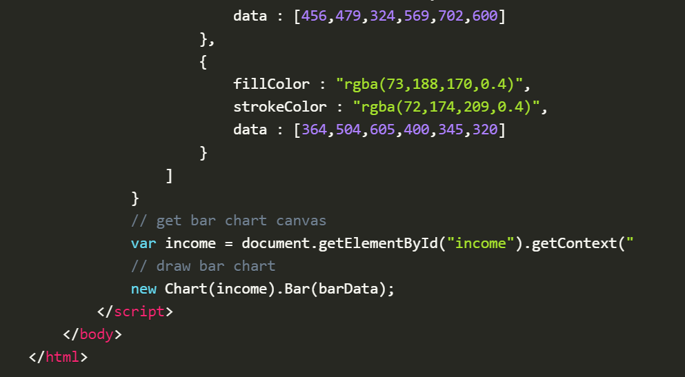

# Docs for the HTML <canvas> Element & Chart.js
## Chart.js, Canvas

## EASILY CREATE STUNNING ANIMATED CHARTS WITH CHART.JS:
 > * Charts are far better for displaying data visually than tables and have the added benefit that no one is ever going to press-gang them into use as a layout tool. They’re easier to look at and convey data quickly, but they’re not always easy to create.

## Drawing a line chart:
 > * To draw a line chart, the first thing we need to do is create a canvas element in our HTML in which Chart.js can draw our chart. So add this to the body of our HTML page:
  > * *\<canvas id="buyers" width="600" height="400">\</canvas>*

 > * Next, we need to write a script that will retrieve the context of the canvas, so add this to the foot of your body element:
  > *  *\*

 > * Inside the same script tags we need to create our data, in this instance it’s an object that contains labels for the base of our chart and datasets to describe the values on the chart. Add this immediately above the line that begins ‘var buyers=’:
  > * 

## Drawing a pie chart
 > * Our line chart is complete, so let’s move on to our pie chart. First, we need the canvas element:
  > * \<canvas id="countries" width="600" height="400">\</canvas>    
 > * Next, we need to get the context and to instantiate the chart:
  > * var countries= document.getElementById("countries").getContext("2d");
       new Chart(countries).Pie(pieData, pieOptions);   
 > * Next we need to create the data. This data is a little different to the line chart because the pie chart is simpler, we just need to supply a value and a color for each section:
  > * 
 > * Now, immediately after the pieData we’ll add our options:
  > * var pieOptions = {
	segmentShowStroke : false,
	animateScale : true
   }       

## Drawing a bar chart
 > * Finally, let’s add  a bar chart to our page. Happily the syntax for the bar chart is very similar to the line chart we’ve already added. First, we add the canvas element:
  > * \<canvas id="income" width="600" height="400">\</canvas>
 > * Next, we retrieve the element and create the graph:
  > * var income = document.getElementById("income").getContext("2d");
      new Chart(income).Bar(barData); 
 > * And finally, we add in the bar chart’s data:
  > * 

## Conclusion
 > * here is the full script:
  > * 
  > * 
  > * 
  > * 

## The \<canvas> element   
 > * At first sight a \<canvas> looks like the \ element, with the only clear difference being that it doesn't have the src and alt attributes. Indeed, the \<canvas> element has only two attributes, width and height. These are both optional and can also be set using DOM properties. When no width and height attributes are specified, the canvas will initially be 300 pixels wide and 150 pixels high. The element can be sized arbitrarily by CSS, but during rendering the image is scaled to fit its layout size: if the CSS sizing doesn't respect the ratio of the initial canvas, it will appear distorted.  

## Fallback content
 > * The <canvas> element differs from an  tag in that, like for <video>, <audio>, or <picture> elements, it is easy to define some fallback content, to be displayed in older browsers not supporting it, like versions of Internet Explorer earlier than version 9 or textual browsers. You should always provide fallback content to be displayed by those browsers.

## The rendering context
 > * The \<canvas> element creates a fixed-size drawing surface that exposes one or more rendering contexts, which are used to create and manipulate the content shown. In this tutorial, we focus on the 2D rendering context. Other contexts may provide different types of rendering; for example, WebGL uses a 3D context based on OpenGL ES.

## Drawing rectangles
 > * Unlike SVG, <canvas> only supports two primitive shapes: rectangles and paths (lists of points connected by lines). All other shapes must be created by combining one or more paths. Luckily, we have an assortment of path drawing functions which make it possible to compose very complex shapes.

## Drawing paths
 > * A path is a list of points, connected by segments of lines that can be of different shapes, curved or not, of different width and of different color. A path, or even a subpath, can be closed. 

## Applying styles and colors
 > * Colors: If we want to apply colors to a shape, there are two important properties we can use: fillStyle and strokeStyle.
 > * Transparency: In addition to drawing opaque shapes to the canvas, we can also draw semi-transparent (or translucent) shapes. This is done by either setting the globalAlpha property or by assigning a semi-transparent color to the stroke and/or fill style.
 > * Line styles: There are several properties which allow us to style lines.
  > * lineWidth = value: Sets the width of lines drawn in the future. 
  > * lineCap = type: Sets the appearance of the ends of lines.
  > * lineJoin = type:  Sets the appearance of the "corners" where lines meet.
  > * miterLimit = value: Establishes a limit on the miter when two lines join at a sharp angle, to let you control how thick the junction becomes.
  > * getLineDash():  Returns the current line dash pattern array containing an even number of non-negative numbers.
  > * setLineDash(segments):  Sets the current line dash pattern.
  > * lineDashOffset = value:  Specifies where to start a dash array on a line.

## A demo of the miterLimit property
 > * The miterLimit property determines how far the outside connection point can be placed from the inside connection point. If two lines exceed this value, a bevel join gets drawn instead. Note that the maximum miter length is the product of the line width measured in the current coordinate system, by the value of this miterLimit property (whose default value is 10.0 in the HTML <canvas>), so the miterLimit can be set independently from the current display scale or any affine transforms of paths: it only influences the effectively rendered shape of line edges.

## Gradients
 > * Just like any normal drawing program, we can fill and stroke shapes using linear and radial gradients. We create a CanvasGradient object by using one of the following methods. We can then assign this object to the fillStyle or strokeStyle properties.

## Canvas fill rules
 > * When using fill (or clip and isPointinPath) you can optionally provide a fill rule algorithm by which to determine if a point is inside or outside a path and thus if it gets filled or not. This is useful when a path intersects itself or is nested.

## Drawing text
 > * The canvas rendering context provides two methods to render text:
  > * fillText(text, x, y [, maxWidth]):  Fills a given text at the given (x,y) position. Optionally with a maximum width to draw.
  > * strokeText(text, x, y [, maxWidth]):  Strokes a given text at the given (x,y) position. Optionally with a maximum width to draw.

## Styling text
 > * There are some more properties which let you adjust the way the text gets displayed on the canvas:
  > * font = value:  The current text style being used when drawing text. This string uses the same syntax as the CSS font property. The default font is 10px sans-serif.
  > * textAlign = value:  Text alignment setting. Possible values: start, end, left, right or center. The default value is start.
  > * textBaseline = value:  Baseline alignment setting. Possible values: top, hanging, middle, alphabetic, ideographic, bottom. The default value is alphabetic.
  > * direction = value:  Directionality. Possible values: ltr, rtl, inherit. The default value is inherit.

## Advanced text measurements
 > * In the case you need to obtain more details about the text, the following method allows you to measure it.
  > * measureText():  Returns a TextMetrics object containing the width, in pixels, that the specified text will be when drawn in the current text style.

*Alaa Aldous*