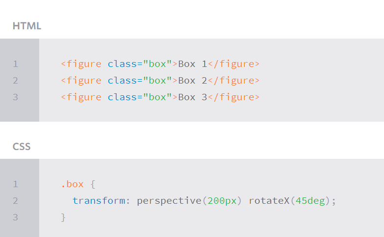
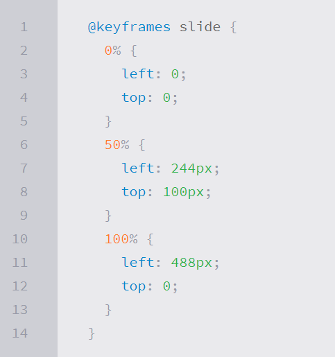

# CSS Transforms, Transitions, and Animations

## Project Aristotle’s researchers:
 > * Project Aristotle’s researchers began by reviewing a half-century of academic studies looking at how teams worked. Were the best teams made up of people with similar interests?
 > * The technology industry is not just one of the fastest growing parts of our economy; it is also increasingly the world’s dominant commercial culture.

## CSS Transforms:
 > * The transform property comes in two different settings, two-dimensional and three-dimensional. Each of these come with their own individual properties and values.

## Transform Syntax:
 > * The actual syntax for the transform property is quite simple, including the transform property followed by the value. The value specifies the transform type followed by a specific amount inside parentheses.
 > * 

## 2D Transforms:
 > *  Two-dimensional transforms work on the x and y axes, known as horizontal and vertical axes. Three-dimensional transforms work on both the x and y axes, as well as the z axis.

## 2D Rotate:
 > * The transform property accepts a handful of different values. The rotate value provides the ability to rotate an element from 0 to 360 degrees. Using a positive value will rotate an element clockwise, and using a negative value will rotate the element counterclockwise. The default point of rotation is the center of the element, 50% 50%, both horizontally and vertically.

 > *  

## 2D Translate:
 > * The translate value works a bit like that of relative positioning, pushing and pulling an element in different directions without interrupting the normal flow of the document. Using the translateX value will change the position of an element on the horizontal axis while using the translateY value will change the position of an element on the vertical axis.
 > * 

## 2D Skew:
 > * The last transform value in the group, skew, is used to distort elements on the horizontal axis, vertical axis, or both. The syntax is very similar to that of the scale and translate values. Using the skewX value distorts an element on the horizontal axis while the skewY value distorts an element on the vertical axis. To distort an element on both axes the skew value is used, declaring the x axis value first, followed by a comma, and then the y axis value.%p.

 > * 

## Combining Transforms:
 > * It is common for multiple transforms to be used at once, rotating and scaling the size of an element at the same time for example. In this event multiple transforms can be combined together. To combine transforms, list the transform values within the transform property one after the other without the use of commas.
  
  > * 

## Transform Origin:
 > * The transform-origin property can accept one or two values. When only one value is specified, that value is used for both the horizontal and vertical axes. If two values are specified, the first is used for the horizontal axis and the second is used for the vertical axis.

  > * 

## Perspective:
 > * The perspective of an element can be set in two different ways. One way includes using the perspective value within the transform property on individual elements, while the other includes using the perspective property on the parent element residing over child elements being transformed.
 > * 

## 3D Transforms:
 > * Using three-dimensional transforms we can change elements on the z axis, giving us control of depth as well as length and width.

## 3D Rotate:
 > * Using the rotateX value allows you to rotate an element around the x axis, as if it were being bent in half horizontally. Using the rotateY value allows you to rotate an element around the y axis, as if it were being bent in half vertically. Lastly, using the rotateZ value allows an element to be rotated around the z axis.
 > * 

## 3D Scale:
 > * By using the scaleZ three-dimensional transform elements may be scaled on the z axis. This isn’t extremely exciting when no other three-dimensional transforms are in place, as there is nothing in particular to scale. In the demonstration below the elements are being scaled up and down on the z axis, however the rotateX value is added in order to see the behavior of the scaleZ value. When removing the rotateX in this case, the elements will appear to be unchanged.
  > * 

## 3D Translate:
 > * Elements may also be translated on the z axis using the translateZ value. A negative value here will push an element further away on the z axis, resulting in a smaller element. Using a positive value will pull an element closer on the z axis, resulting in a larger element.
  > * 

## Transform Style:
 > * The transform-style property needs to be placed on the parent element, above any nested transforms. The preserve-3d value allows the transformed children elements to appear in their own three-dimensional plane while the flat value forces the transformed children elements to lie flat on the two-dimensional plane.
  > * 

## Backface Visibility:
 > * When working with three-dimensional transforms, elements will occasionally be transformed in a way that causes them to face away from the screen. This may be caused by setting the rotateY(180deg) value for example. By default these elements are shown from the back. So if you prefer not to see these elements at all, set the backface-visibility property to hidden, and you will hide the element whenever it is facing away from the screen.

 > *  

# Transitions & Animations

 > * With CSS3 transitions you have the potential to alter the appearance and behavior of an element whenever a state change occurs, such as when it is hovered over, focused on, active, or targeted.
 > * Animations within CSS3 allow the appearance and behavior of an element to be altered in multiple keyframes. Transitions provide a change from one state to another, while animations can set multiple points of transition upon different keyframes.

## Transitions:
 > * There are four transition related properties in total, including transition-property, transition-duration, transition-timing-function, and transition-delay. Not all of these are required to build a transition, with the first three are the most popular.
  > * 

## Transitional Property:
 > * The transition-property property determines exactly what properties will be altered in conjunction with the other transitional properties. By default, all of the properties within an element’s different states will be altered upon change. However, only the properties identified within the transition-property value will be affected by any transitions.

 > * 

## Transitional Properties:
 > * It is important to note, not all properties may be transitioned, only properties that have an identifiable halfway point. Colors, font sizes, and the alike may be transitioned from one value to another as they have recognizable values in-between one another. The display property.
 > * 

## Transition Duration: 
 > * The duration in which a transition takes place is set using the transition-duration property. The value of this property can be set using general timing values, including seconds (s) and milliseconds (ms). These timing values may also come in fractional measurements, .2s for example.
  > * 

## Transition Timing:
 > * The transition-timing-function property is used to set the speed in which a transition will move. Knowing the duration from the transition-duration property a transition can have multiple speeds within a single duration. A few of the more popular keyword values for the transition-timing-function property include linear, ease-in, ease-out, and ease-in-out.
 > * The linear keyword value identifies a transition moving in a constant speed from one state to another. The ease-in value identifies a transition that starts slowly and speeds up throughout the transition, while the ease-out value identifies a transition that starts quickly and slows down throughout the transition. The ease-in-out value identifies a transition that starts slowly, speeds up in the middle, then slows down again before ending.
  > * 

## Transition Delay:
 > * The delay sets a time value, seconds or milliseconds, that determines how long a transition should be stalled before executing. As with all other transition properties, to delay numerous transitions, each delay can be declared as comma separated values.
  > * 

# Animations:

## Animations Keyframes:
 > * To set multiple points at which an element should undergo a transition, use the @keyframes rule. The @keyframes rule includes the animation name, any animation breakpoints, and the properties intended to be animated.
  > * 

## Animation Name:
 > * To do so, the animation-name property is used with the animation name, identified from the @keyframes rule, as the property value. The animation-name declaration is applied to the element in which the animation is to be applied to.
 > * 

## Animation Iteration:
 > * By default, animations run their cycle once from beginning to end and then stop. To have an animation repeat itself numerous times the animation-iteration-count property may be used. Values for the animation-iteration-count property include either an integer or the infinite keyword. Using an integer will repeat the animation as many times as specified, while the infinite keyword will repeat the animation indefinitely in a never ending fashion.
 > * 

# 8 simple CSS3 transitions that will wow your users:

 > 1. Fade in:
  > * Fade in effects are coded in two steps: first, you set the initial state; next, you set the change, for example on hover:
   > * 

 > 2. Change color:
  > * Animating a change of color used to be unbelievably complex, with all kinds of math involved in calculating separate RGB values and then recombining them. 
   > * 

 > 3. Grow & Shrink:
  > * To grow an element, you used to have to use its width and height, or its padding. But now we can use CSS3’s transform to enlarge.Set your div’s class to “grow” and then add this code to your style block:
   > * 
   > * 

 > 4. Rotate elements:
  > * CSS transforms have a number of different uses, and one of the best is transforming the rotation of an element. Give your div the class “rotate” and add the following to your CSS:
   > * 

 > 5. Square to circle:
  > * A really popular effect at the moment is transitioning a square element into a round one, and vice versa. With CSS, it’s a simple effect to achieve, we just transition the border-radius property.Give your div the class “circle” and add this CSS to your styles:
   > * 

 > 6. 3D shadow:
  > * This effect is achieved by adding a box shadow, and then moving the element on the x axis using the transform and translate properties so that it appears to grow out of the screen.Give your div the class “threed” and then add the following code to your CSS:
   > * 

 > 7.  Swing:
  > * Not all elements use the transition property. We can also create highly complex animations using @keyframes, animation and animation-iteration.In this case, we’ll first define a CSS animation in your styles. You’ll notice that due to implementation issues, we need to use @-webkit-keyframes as well as @keyframes (yes, Internet Explorer really is better than Chrome, in this respect at least).
   > * 

 > 8. Inset border:
  > * One of the hottest button styles right now is the ghost button; a button with no background and a heavy border. We can of course add a border to an element simply, but that will change the element’s position. We could fix that problem using box sizing, but a far simpler solution is the transition in a border using an inset box shadow.Give your div the class “border” and add the following CSS to your styles: 
   > * 

*Alaa Aldous*

