# HTML Lists, CSS Boxes, JS Control Flow

## Lists:
 > We will learn about:
 * Numbered lists.
 * Bullet lists.
 * Definition lists.

1. Numbered lists or *ordered lists* :
  > Ordered lists are lists where each item in the list is
numbered.

2. Bullet lists or *unordered lists* :
 > Unordered lists are lists that begin with a bullet point
(rather than characters that indicate order).

3. Definition lists:
 > Definition lists are made up of a set of terms along with the
definitions for each of those terms.

## How do we create an ordered list?
 > The ordered list is created with
the \<ol> element.

**Each item in the list is placed
between an opening \<li> tag
and a closing \</li> tag. (The li
stands for list item.)** 

 > 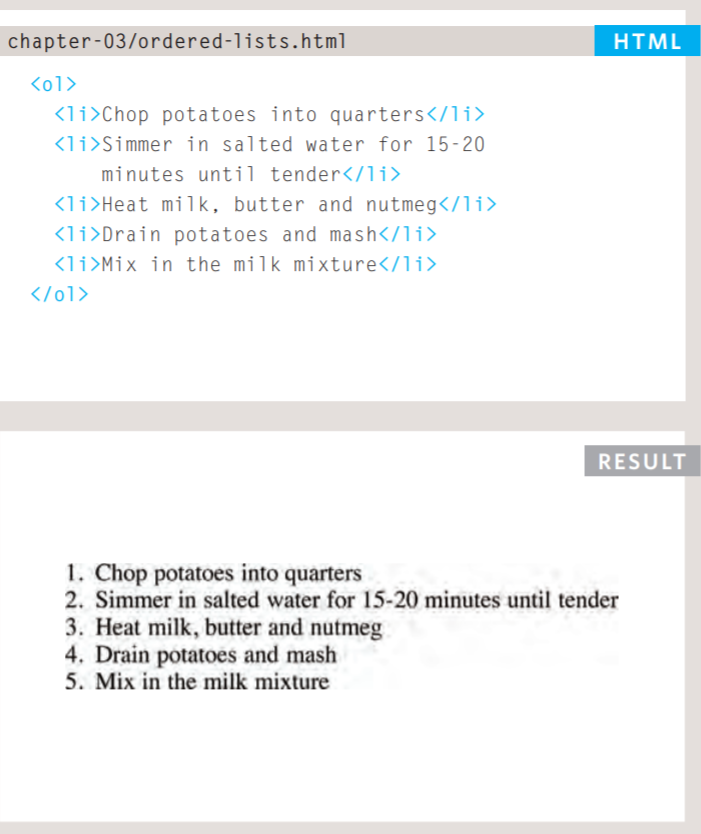

## How to create unordered list?
 > The unordered list is created
with the \<ul> element.

**Each item in the list is placed
between an opening \<li> tag
and a closing \</li> tag. (The li
stands for list item.)** 

 > 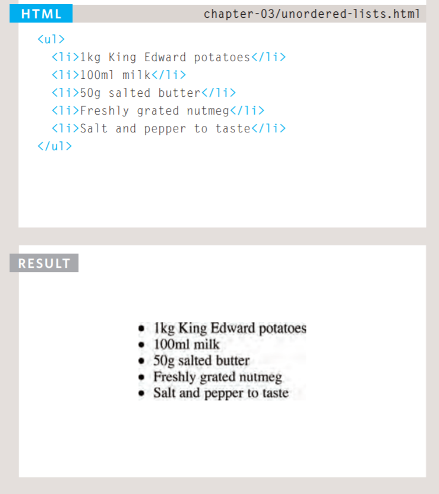

## How to create a  definition list?
 > The definition list is created with
the \<dl> element and usually
consists of a series of terms and
their definitions. 
 
 > Inside the \<dl> element you will
usually see pairs of \<dt> and
\<dd> elements.
 *\<dt> This is used to contain the term being defined (the definition term).*
 *\<dd> This is used to contain the definition.*

 > 

# Lists Summary:
  > * There are three types of HTML lists: ordered, unordered, and definition.
  > * Ordered lists use numbers.
  > * Unordered lists use bullets.
  > * Definition lists are used to define terminology.
  > * Lists can be nested inside one another.

# Boxes:
 ## Control the dimensions of your boxes:
  *width, height*
  > 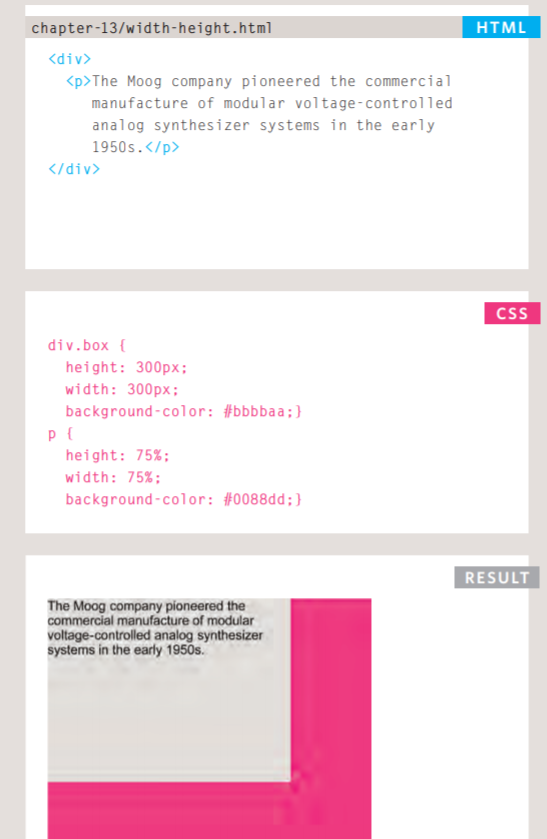

## Limiting Width
 *min-width, max-width*
  > 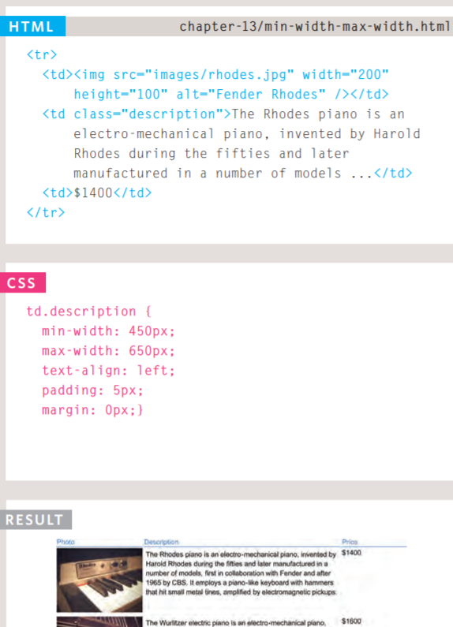

## Limiting Height
  *min-height, max-height*
  > 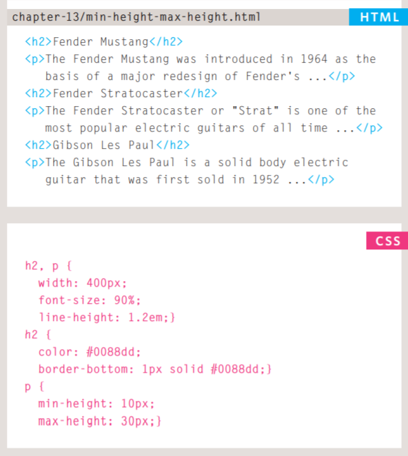

# Overflowing Content: 

 ## overflow:
  > The overflow property tells the
browser what to do if the content
contained within a box is larger
than the box itself. It can have
one of two values:
  > * hidden:
This property simply hides any
extra content that does not fit in
the box.
  > * scroll:
This property adds a scrollbar to
the box so that users can scroll
to see the missing content.

> 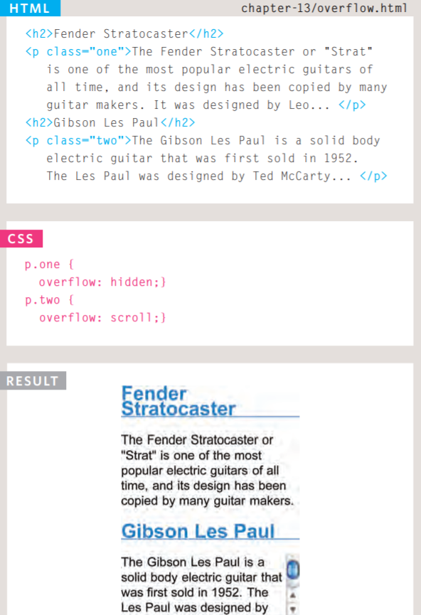

# Border, Margin & Padding:
 > * Border: Every box has a border (even if
it is not visible or is specified to
be 0 pixels wide). The border
separates the edge of one box
from another.
 > * Margin: Margins sit outside the edge
of the border. You can set the
width of a margin to create a
gap between the borders of two
adjacent boxes.
 > * Padding: Padding is the space between
the border of a box and any
content contained within it.
Adding padding can increase the
readability of its contents.

# Boxes Summary: 
 > * CSS treats each HTML element as if it has its own box. 
 > * You can use CSS to control the dimensions of a box.
 > * You can also control the borders, margin and padding
for each box with CSS.
 > * It is possible to hide elements using the display and
visibility properties.
 > * Block-level boxes can be made into inline boxes, and
inline boxes made into block-level boxes.
 > * Legibility can be improved by controlling the width of
boxes containing text and the leading.
 > * CSS3 has introduced the ability to create image
borders and rounded borders.

# ARRAYS:
## What is an array?
> An array is a special type of variable. It doesn't
just store one value; it stores a list of values. 

## How to create an array?
 > You create an array and give it
a name just like you would any
other variable (using the var
keyword followed by the name of
the array).
  > 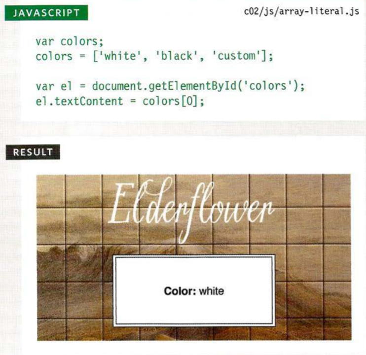

## VALU ES IN ARRAYS:
 > Values in an array are accessed as if they are in
a numbered list. It is important to know that the
numbering of this list starts at zero (not one).

# EXPRESSIONS:
## An expression evaluates into (results in) a single value. Broadly speaking there are two types of expressions:
 > 1. EXPRESSIONS THAT JUST ASSIGN A
VALUE TO A VARIABLE.
   > In order for a variable to be useful, it needs to be
given a value. As you have seen, this is done using
the assignment operator (the equals sign). 
    > 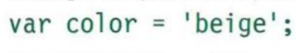

 > 2. EXPRESSIONS THAT USE TWO OR
MORE VALUES TO RETURN A
SINGLE VALUE.
  > You can perform operations on any number of
individual values (see next page) to determine a
single value.
    > 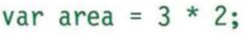

# OPERATORS:
## Expressions rely on things called operators; they allow programmers to create a single value from one or more values.    

## ARITHMETI C OPERATORS:
 > JavaScript contains the following mathematical
operators, which you can use with numbers.
You may remember some from math class. 
   > 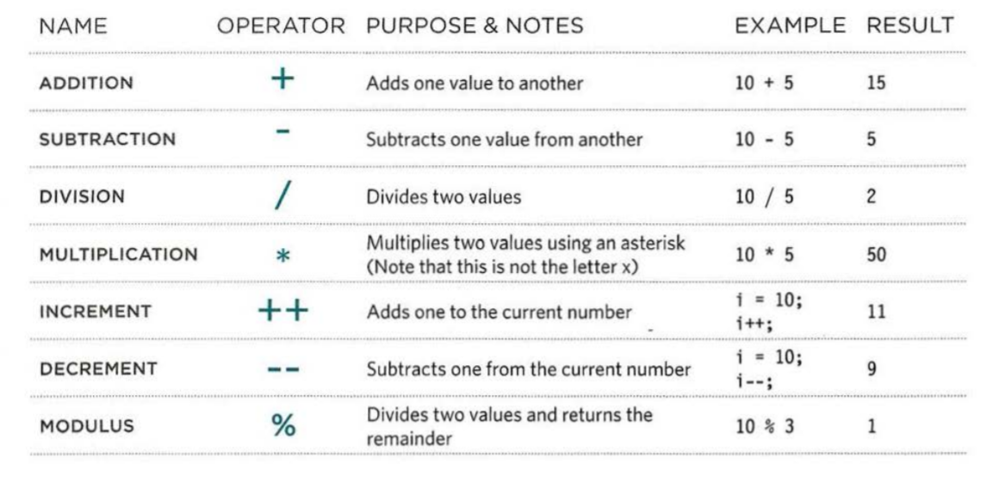

## STRING OPERATOR:
 > There is just one string operator: the+ symbol.
It is used to join the strings on either side of it. 
  > 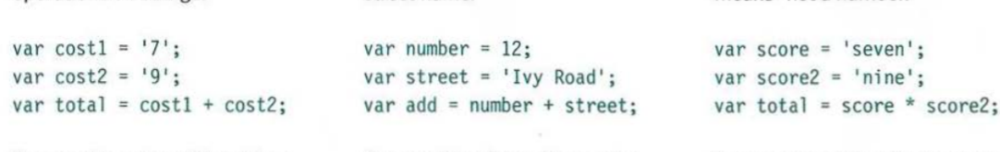

# IF...Else statements:
 > the if... else statement checks a condition, if it resolves to true the first code block is executed. if the condition resolves to false the second code block is run instead.

   > 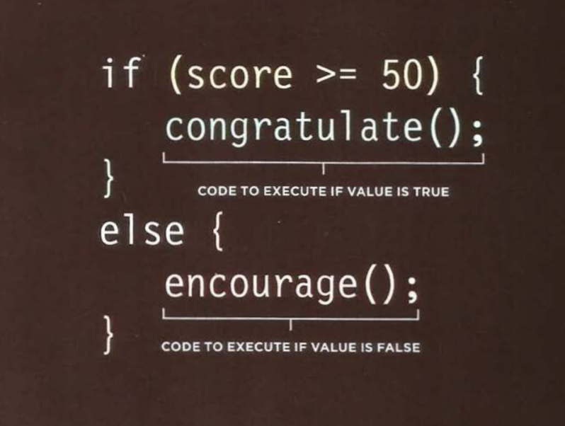

# SWITCH STATEMENTS:
 > A switch statement starts with a
variable called the switch value.
Each case indicates a possible
value for this variable and the
code that should run if the
variable matches that value. 

  > 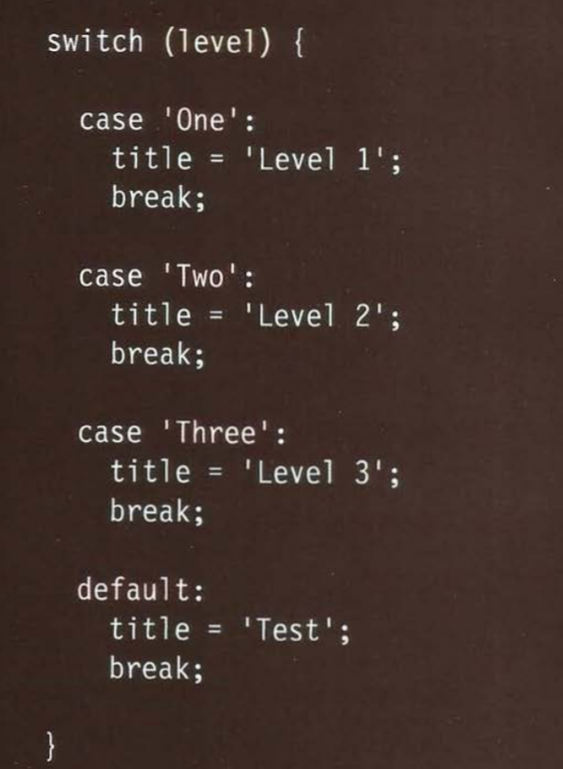

## TRUTHY & FALSY VALUES:
  > Due to type coercion, every value in JavaScript
can be treated as if it were true or false; and
this has some interesting side effects. 

# Loops:
> Loops check a condition, if it returns true, a code block will run, then the condition will be checked again and if it still returns true, the code block will run again, it repeats until the condition returns false. 
 
 ## There are three common types of loops:
  > 1. for.
  > 2. while.
  > 3. do while.
    
# Summary: 
 > * Conditional statements allow your code to make
decisions about what to do next. 
 > * Comparison operators (===, ! ==, ==, ! =, <, >, <=, =>)
are used to compare two operands. 
 > * Logical operators allow you to combine more than one
set of comparison operators. 
 > * if ... else statements allow you to run one set of code
if a condition is true, and another if it is false. 
 > * switch statements allow you to compare a value
against possible outcomes (and also provides a default
option if none match). 
 > * Data types can be coerced from one type to another. 
 > * All values evaluate to either truthy or falsy. 
 > * There are three types of loop: for, while, and
do ... while. Each repeats a set of statements.     
 
 

    

